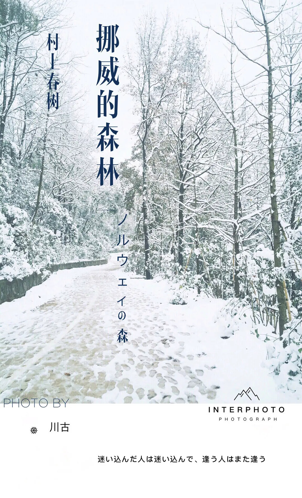

# 死并非生的对立面，而作为生的一部永存

> 发布日期：2019-10-18 @Flc

> 图片转载自 https://www.douban.com/group/topic/130812921/ 

----

!!! quote ""

    死并非生的对立面，而作为生的一部永存 

    > —— 村上春树《挪威的森林》

早上最直接想到的一句话。曾经对这句话的理解是字面意思。从书中主人公的结果而言，觉得它更倾向是一句正能量的话。

死者与死者留下的意志，甚至其他可以影响的东西，都留给生者。而生者，则带着这些东西，继续活着。

主人公渡边君的好友木月死了，木月的女朋友直子去精神病院；喜欢直子的渡边君继续活着，希望带着直子走出死者的阴影中。最后的结局就引用原书的一句话吧：

!!! quote ""
    
    四季更迭，我与死者之间的距离亦随之渐渐拉开。木月照旧十七，直子依然二十一，永远地。

而今天站在不同的心境，重新解读这句话。

这个死，真的只是“死者”吗？好像又不仅仅如此。好像还包括那些已经变得不存在，已经失去的东西。而那这些失去的东西，或者说留下的遗憾，还一直陪伴着生者继续长存。这些东西，有好，有不好的。但对生者的影响，应该足够影响一生。

对于一生的影响，又得看自己如何看待这些东西。就好像渡边君一样，面对并让自己挣脱出来，最后他活下来了。又如直子一样，无法摆脱死者带来的阴影，即使本心想走出来，可还是没成功，最后永远的停留在了二十一岁。

不同的角度，看待事务，总会有不同的结果。死并非生的对立面，死潜伏在我们的生之中。最后留两句摘自原著的话共勉。

!!! tip "共勉"

    - 无论熟知怎样的哲理，也无以消除所爱之人的死带来的悲哀。无论怎样的哲理，怎样的真诚，怎样的坚韧，怎样的柔情，也无以排遣这种悲哀。我们惟一能做到的，就是从这片悲哀中挣脱出来，并从中领悟某种哲理。
    - 在风和日丽的天气里荡舟于美丽的湖面，我们会既觉得蓝天迷人，又深感湖水多娇 ——二者同一道理。不必那么苦恼。纵令听其自然，世事的长河也还是要流往其应流的方向，而即使再竭尽人力，该受伤害的人也无由幸免。所谓人生便是如此。