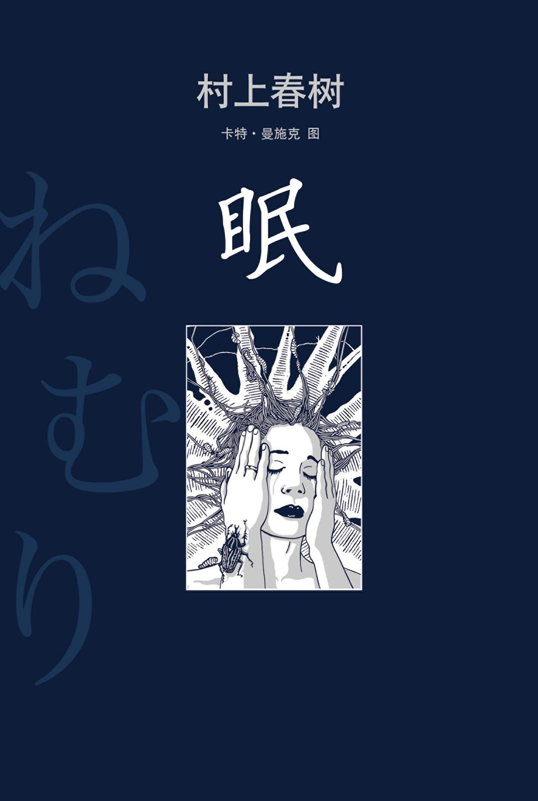

# 眠

> 发布日期：2019-11-19 18:23:10

-----

下面摘录的这段文字是摘自村上春树的《[眠](https://book.douban.com/subject/21692813/)》。

----

最近一段时间的心情，以及状态，我无法用语言或者文字表达出来。

这本书是无意中读到的，发现这段文字正是描绘此时此景的我，而且是 **最恰当不过** 。

唯独的差别，就是：这个月里我瘦了 10 公斤。

我把这段文字发给我身边的朋友，跟他们说，这是我的近况。TA 们都说：“看不懂”。

还有的建议我去一趟西藏，当然还有不少 “幸灾乐祸” 的说，你是不是 “灵魂出鞘” 了。。。

然后我。。。

!!! tip "《眠》摘录"

    我的肉体蹒跚地彷徨在微明中，又始终感觉自身意识的视线与气息近在身畔。==我是企待睡去的肉体，也是行将醒来的意识==。

    白日里，我时常浑浑噩噩，仿佛大脑蒙着一层薄膜，无法辨清事物的正确距离、质量和触感。而且每隔一定的间歇，柔软的缺漏便如同弛缓的波浪涌流而至。坐在电车的座椅上、教室的课桌前，抑或晚餐的席位上，不知不觉间我便会朦胧入睡。意识曾几何时游离我的肉体而去。世界无声地摇颤，将形形色色的东西抖落在地。铅笔、手提袋和餐叉发出声响掉落在地板上。我很想猛然伏在那里，沉沉睡去。然而不成。清醒始终觊觎在近旁，我时时感觉它冷冰冰的影子。那是我自己的影子。奇怪，我一面昏昏欲睡一面暗忖。我身处自己影子的内侧。==我在那迟钝而无感觉的冥暗中行走、进餐、与人交谈。不可思议的是，周围的人都不曾察觉我被放置在这种奇异状态中。那一个月里我瘦了六公斤。== 可尽管如此，家人和朋友居然都没有察觉这种异变，没有察觉我始终活在昏昏欲睡的状态之中。

    是的，我名副其实地生活在睡眠中。在我的周遭，在我的内部，一切东西都凝滞而沉重，阴沉而混浊。就连自己生存于这个世界的状态，都像是不牢靠的幻觉。似乎只要刮起一阵强风，我的肉体就将被吹到世界尽头，吹到天涯海角见所未见闻所未闻的土地。而我的肉体将在那里与我的意识永远分离。==所以我很想牢牢抓住某样东西。然而纵目四望，周边却看不到一样可以抓牢的事物。==

    每到夜间，猛烈的清醒便倏然而至。在这清醒面前，我束手无策。我被强大的力量牢牢固定在清醒的核心。那力量过于强大，我只能始终清醒着直至天亮。在夜的黑暗中，我一直醒觉如昼。甚至不会思考。聆听着时钟镌刻时间的声音，==我唯有凝望黑暗一点点变深，再一点点变淡== 。