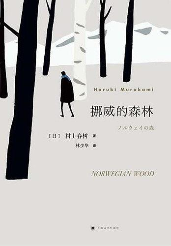
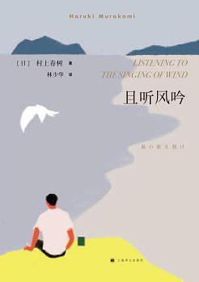
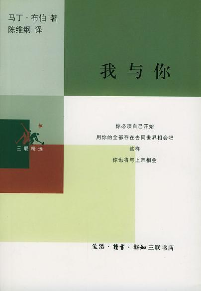
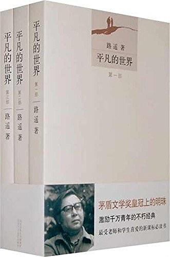
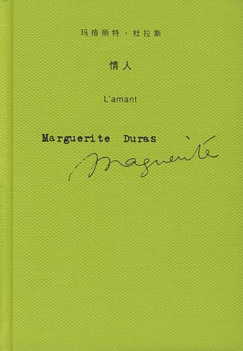

description: 2019 年的秋天，冬天，似乎格外难熬。这个世界还会好吗？我们的生活还会好吗？在悲伤和沮丧上演的时候，积极、善意、温情和希望也从未缺席。2020 年已然将至，迈克尔·柯蒂兹导演的电影《卡萨布兰卡》里有句话说：“如今你的气质里，藏着你走过的路，读过的书和爱过的人。”。

# 书单 | 我的 2019

> 发布时间：2019-12-07 15:52:37

!!! warning ""

    :two::zero::one::nine: :point_right::point_right::point_right: :two::zero::two::zero:

    版权说明：本文部分图片素材转载自豆瓣，如涉及侵权，请联系本人。

    内容说明：**部分内容可能涉及剧透。**

----

[TOC]

----

## 写在开头

2019 年的秋天，冬天，似乎格外难熬。

这个世界还会好吗？我们的生活还会好吗？

**在悲伤和沮丧上演的时候，积极、善意、温情和希望也从未缺席。**

2020 年已然将至，迈克尔·柯蒂兹导演的电影《卡萨布兰卡》里有句话说：“如今你的气质里，藏着你走过的路，读过的书和爱过的人。”。

刚要成熟，又要老去。

2019 读完的 12 本；在读/未读完，却值得推荐的；以及计划在 2020 年要读的。

----

## 2019 读完的

!!! tip ""
    
    内容将按读完时间先后顺序介绍，其中推荐指数满星为 5 星。
    
    > 推荐指数也仅基于个人及现如今的心境的评分，并不适用所有人。**So，仅供参考**。

### 1. 刘慈溪《[流浪地球](https://book.douban.com/subject/30455321/)》

推荐指数：3 星

看这本书是起源于年初上映的同名电影。电影相比于原著，电影会相对好看些，虽然剧情内容跟原著基本不搭边。

大多数人应该都对未知充满了渴望。这也包括我。

### 2. 汪洁《[时间的形状](https://book.douban.com/subject/26992254/)》

推荐指数：4 星

“相对论”这个概念经常听到，但一直都不知半解，于是便一探究竟……

内容讲的大多都是科学家发现一些奥秘的内容。每一个成功都是站在巨人的肩膀上。

印象最深的一句话：

> 当一个理论只能”证实“而不能”证伪“，并且也无法作出可靠的预言时，我们暂不能承认它是科学的，而只能当做一种见解去理解。

这就好像：心理学不是科学，只能作为一种学问，它基于长年累月的经验得出一些结论，而且往往很准确，但无法做到 100% 准确。

事实上，科学无法永远证明它是对的，但一旦证明它是错的，那这个理论，便不攻自破。但有时候又不一定如此，就好像牛顿力学的理论无法在狭义相对论中生效，所以有时候，科学又需要在一定的条件下才满足。

### 3. 汪洁《[星空的琴弦](https://book.douban.com/subject/27082359/)》

推荐指数：3.5 星

介绍的更多是天文学的一些发展史和大事件。如果看过《时间的形状：相对论史话》，本书可不看，部分重复。

中国的天文学发展还是较为落后。这主要源于古代帝王，也就是天子，对”天象“观测更多的用于朝代的兴衰预测，为此特别的重视。正因为如此，古代中国拥有世界上最成建制的天象观测机构，且要求极为严苛。不过中国的天文观测记录是世界上最详细、最整齐、最规范的，没有之一。但一直到明清时期，中国的最主流思想依然还是天圆地平，依然认为所有天体都围绕地球转。

这本书印象较深的还是其中一个章节，关于介绍”熵“的短故事，具体内容可查看：《[最后的问题](../201910/final-question.md)》

### 4. 刘慈欣《[朝闻道](https://book.douban.com/subject/27191786/)》

推荐指数：3 星

“宇宙”的目的是什么？朝闻道，夕死可矣...

道可道，非常道；名可名，非常名...

属于看完就忘系列... :joy: :joy:

表达的更倾向一种追求真理的态度。

### 5.  安迪·莱利 《[作死的兔子大全集](https://book.douban.com/subject/26681602/)》

推荐指数：1 星

漫画书，西式的冷幽默，不太适合我。

### 6. 刘慈欣《[超新星纪元](https://book.douban.com/subject/3636385/)》

推荐指数：3.5 星

一次灾难，世界只剩下孩子。

在即将离开孩子的成人眼中，我们该如何放手，该如何让 TA 们面对未知的世界。

在懵懂，心智不成熟的孩子眼中，这样的世界——新鲜、刺激、有趣。面对饥饿，寒冷的时候，又是惊慌失措。他们把战争，当成游戏；武器，是他们的玩具。但孩子的想象力，创造力，却是无限的。

书是 1991 年作者写的，内容在那时候，应该算是很有创意和想象力了。而且基于那时候就能描述出现代的人工智能，算是脑洞很大了。

### 7. 蔡智恒《[夜玫瑰](https://book.douban.com/subject/3140452/)》

推荐指数：3 星

作者痞子蔡，台湾网络小说作家。了解这个人，是因为很久很久很久很久...以前，大概高二吧，读过的第一本小说正是他写的——《[第一次亲密接触](https://book.douban.com/subject/3188320/)》。

《第》的印象还是比较深刻，除了这本书在那个年代很火以外。还因为后来读书的时候，有位语文老师也曾在课堂上提及过这本书，当时她念过里面的一段文字：

> 如果我有一千万，我就能买一栋房子。  
> 我有一千万吗？没有。  
> 所以我仍然没有房子。  
> 如果我有翅膀，我就能飞。  
> 我有翅膀吗？没有。  
> 所以我也没办法飞。  
> 如果把整个太平洋的水倒出，也浇不熄我对你爱情的火。  
> 整个太平洋的水全部倒得出吗？不行。  
> 所以我并不爱你。  

如今回想起来，觉得这样的比喻和排比，看不出任何水平。

《夜》这本书就当是爱情小说看看就好了...因为内容基本忘却了，所以...

总结呢？...

**大部分人的一生，都会有所缺憾，也正因为缺憾，让我们更成熟或是更珍惜一切。**

### 8. 蔡智恒《[槲寄生](https://book.douban.com/subject/26421225/)》

推荐指数：3.5 星

又是痞子蔡的作品，相比《夜》会好不少。当我看完《挪》（下文介绍）的时候，发现这本书应该是作者根据《挪》写的。只不过深度却没有《挪》的好。但也正是因为这本书让我了解到《挪》。

槲寄生——寄生在寄主的一种植物，依靠吸收寄主的水分和无机物生存。如同菜虫寄生在明菁一样，“渣男”一般的存在...

这突然让我想起另外一本书：渡边淳一的《[化身](https://book.douban.com/subject/1097725/)》。

> 事业有成的五十三岁男人秋叶，结识了淳朴而羞涩的乡下姑娘雾子。他教她高雅的着装与谈吐，使她学会享受生活和情爱的愉悦，甚至帮她拥有了独立的事业。雾子在秋叶的精心雕琢下，渐渐蜕变为风情万种的魅力女性。然而，觉醒了的金丝雀还愿意待在笼子中吗？最终，羽翼丰满的小鸟，飞入了自由的天空；而曾经的养鸟人，在一番挣扎之后，也终于放手。

**人生最可悲就是，你教会了我，我也教会了你，而我们，却不能在一起。**

### 9. 村上春树《[挪威的森林](https://book.douban.com/subject/1046265/)》

推荐指数：4.5 星

《挪》应该算是今年读过的最好的一本书，也是力荐的一本。

作者村上春树，写的小说从不直接写自己的经历和体验，也不写家庭。甚至小说中，也不会过多的写主人公的内心世界；更不会直接的表达一些观点。而只是通过事物的发展以及变化，传达内涵。如果非亲身经历或者拥有足够的体验，读他的小说，可能会无法知道小说在传达什么。

**死并非生的对立面，而作为生的一部永存。**

关于《挪》的介绍，就请看我写的另一篇日志吧：《[死并非生的对立面，而作为生的一部永存](../201910/death-is-not-the-opposite-of-life-but-as-a-life-forever.md)》，以下是部分摘录：

>早上最直接想到的一句话。曾经对这句话的理解是字面意思。从书中主人公的结果而言，觉得它更倾向于是一句正能量的话。
> 
> 死者与死者留下的意志，甚至其他可以影响的东西，都留给生者。而生者，则带着这些东西，继续活着。
> 
> 主人公渡边君的好友木月死了，木月的女朋友直子去了精神病院；喜欢直子的渡边君继续活着，希望带着直子走出死者的阴影。最后的结局，就引用原书的一句话吧...

### 10. 阿尔伯特·克雷格 《[哈佛极简中国史](https://book.douban.com/subject/30443966/)》

推荐指数：4 星

喜欢历史的朋友可以看看。书是外国人写的。看待中国的历史发展也是一种别样的角度。

比如关于“思想”的问题。国人受几千年来的传统文化熏陶，首当其冲的就是“儒学”思想。

而“儒学”讲究的是“君子”，对它的定义是：行为高尚，拥有人道、诚实、正直、无私、忠诚等内在美德，并且行为举止合乎礼仪的人。

乍一看，确实讲究，如此优秀的人，怎么能不给个小板凳坐坐。

再来看看国外的“绅士”。绅士早期是指出身贵族的人，后来指代举止彬彬有礼的人。我记得曾看过一句话，来描述绅士：“所做的，不是自己想做之事，而是自己应做之事。”

在乍一看，确实不讲究，没有“君子”来的更具内涵。确实如此，书的作者也这么承认。

儒家思想看重的是：“君臣父子”，讲究“忠孝礼义仁智信”。究其根本，在于帝王需要忠臣；而“儒家”的君子，能满足。而思想往往都是由统治者决定。这也是为何“儒家”能成为几千年文化的一个原因之一。

但却忽略女性这一角色。“重男轻女”，这类思想，至今还存在着。而“绅士”却可以让“女性”这一角色站出来。

说这些，并非说“君子”与“绅士”的好与坏。**取其所长，弃其所短，才是正确认知世界的态度。**

毕竟无论是君子还是绅士，要想做到，都很难。

### 11. 村上春树《[且听风吟](https://book.douban.com/subject/30144098/)》

推荐指数：3.5 星

《且》是村上春树的成名处女作。”不存在十全十美的文章，如同不存在彻头彻尾的绝望“。

”我“捡到一个醉酒女孩，因为奇妙的感觉，互相吸引，产生一种朦胧的情感。最后的最后，女孩不知去向，短暂的情感到此结束。

看海看久了想见人，见人见多了想看海。

距离感是书想表达的。**距离产生自由，自由却是最可贵的。**

> ”直言不讳是极为困难的事。甚至越是想直言不讳，直率的言语越是遁入黑暗的身处“。因此人与人之间的沟通和理解几乎是不可能的。任何尝试都可能是徒劳的，甚至伤害对方。最为明智的做法就是同对方保持距离，不要靠的太近，更不要动辄强加于人。在这个意义上，距离就是理解，就是温情，就是关心。

生活本身在很长时间里也是单调的、不是滋味的……这些深深沁入骨髓。讨厌的人也有，讨厌的事也堆积如山……可有这样感受的人，不止我一个……而我，不得不默默忍受自己处境……我也有过试图冷静生活的时候……可那又怎样……毕竟，任何人，任何事，都可以在人的洪流与时间的长河中消失的无影无踪……

于是：**人生苦短，珍惜当下，秉烛夜游，及时行乐，一切岂非已然过往。**

### 12. 村上春树《[眠](https://book.douban.com/subject/21692813/)》

推荐指数：4 星

《眠》是无意中发现，基于那时候的自身状态，觉得这个标题很适合我。

实际的内容确实符合，关于具体介绍就看我写的另一片日志吧。《[眠](../201911/mian.md)》，以下是部分摘录：

> 最近一段时间的心情，以及状态，我无法用语言或者文字表达出来。
> 
> 这本书是无意中读到的，发现这段文字正是描绘此时此景的我，而且是最恰当不过 。
> 
> 唯独的差别，就是：这个月里我瘦了 10 公斤。  

## 在读/未读完，却值得推荐的

### 1. 烽火戏诸侯《[剑来](https://baike.baidu.com/item/%E5%89%91%E6%9D%A5/20832055?fr=aladdin)》

推荐指数：4.5 星

> 大千世界，无奇不有。我陈平安，唯有一剑，可搬山，倒海，降妖，镇魔，敕神，摘星，断江，摧城，开天！————我叫陈平安，平平安安的平安，我是一名剑客。

看似一本武侠网络小说，却更多的是一本**心性养成**的小说。

成为最想成为的人：

- 齐静春——言念君子，温其如玉。齐静春对陈平安说：“陈平安，请你不要对这个世界失望”。
- 陈平安——赤子之心；陈平安就像一面镜子，能照映出人的善恶美丑。

小说的世界观很庞大，采用”儒家“、”道家“等思想去描述整个世界。作者对人物心理刻画相当细腻。内容的铺垫也做得特别深，且不留痕迹。

书的内容特别多，且内容节奏特别缓慢，适合沉得住气的人去看。

> 已经很长时间没看了，偶尔换个心情，看看其他的，再回来看，也是一种不错的方式。

### 2. 马丁·布伯《[我与你](https://book.douban.com/subject/1051659/)》

推荐指数：4.5 星

这本书是通过武志红了解到的，也是他极力推荐的一本书。书的内容是关于”关系“的哲学性理解。

这本书初期看了一部分后，就大致理解了意思。因为内容过于深奥，以至于烧脑，导致让我读这本书有一些排斥。这种感觉就是什么呢？用两张图来感受下吧...

> 玩手机时候的我

> 读这本书时候的我

有时候，我们往往会对一个人有这样一种印象：”这个人哪方面都很优秀，包括亲人，朋友都这么觉得。但总感觉又不一样。“

人与人的关系是基于，“我与你”，“我与它”的关系。当我去为了你去做某件事的时候，实际这件事是“我与它”的关系，从中获得的感受是“我与你”的关系。“我与它”也就是这件事，即使在优秀，但“我与你”没有得到升华。那这个优秀，在人与人的关系里，并不是最佳的。

有关于这本书的一点点理解，可查看我的另一篇日志：《[我与你，我与它](../201911/you-and-me.md)》

### 3. 起风了

### 4. 武志红心理学：《[为何家会伤人](https://book.douban.com/subject/2080764/)》、《[为何越爱越孤独](https://book.douban.com/subject/3712855/)》、《[愿你拥有被爱照亮的生命](https://book.douban.com/subject/26672431/)》、《[感谢自己的不完美](https://book.douban.com/subject/25858916/)》

<table class="no-class">
    <tr>
        <td align="center"></td>
        <td align="center"></td>
        <td align="center"></td>
        <td align="center"></td>
    </tr>
</table>

推荐指数：4 星

有时候加深对自己了解，反而能让自己感知世界的时候，更有信心。

## 2020 计划的

### 1. 路遥《[平凡的世界](https://book.douban.com/subject/1200840/)》

这本书的评分很高，各种榜单，公众号文章都有提及过。

### 2. 埃莱娜·费兰特《[我的天才女友](https://book.douban.com/subject/26878124/)》

”那不勒斯四部曲“之一。全球畅销百万册，被翻译成40种语言。

作者——《金融时报》2015年度女性；2016《时代》周刊“世界最有影响力的100人”。

### 3. 埃莱娜·费兰特《[失踪的孩子](https://book.douban.com/subject/30172069/)》

”那不勒斯四部曲“之一

### 3. 玛格丽特·杜拉斯《[情人](https://book.douban.com/subject/1400705/)》

我曾对我的妻子说：“与你那时的面貌相比，我更爱你现在备受摧残的面容”。

这句话正源于这本书。

### 5. 林奕含《[房思琪的初恋乐园](https://book.douban.com/subject/27614904/)》

豆瓣《2018年度最受关注图书》TOP 1。

作者林奕含（1991年03月16日 至 2017年04月27日），台湾作家。本书是其生前唯一出版作品。后自缢身亡。

> 小说讲述了美丽的文学少女房思琪被补习班老师李国华长期性侵，最终精神崩溃的故事。小说由作者根据自身经历创作完成，以极度贴近被侵害者的视角，直直逼视主人公遭受侵害的痛苦。

## 写在最后

无常如风起，人生不可弃。

总还有东西值得我们去期待，去相信，去坚守。

2019年最后一个月，寒冬将至，春花可期，你好 2020。