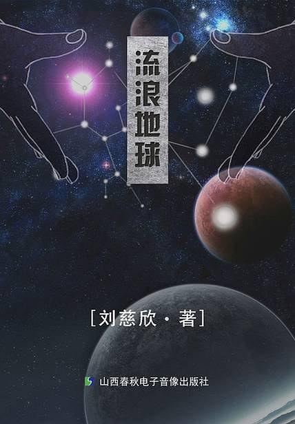
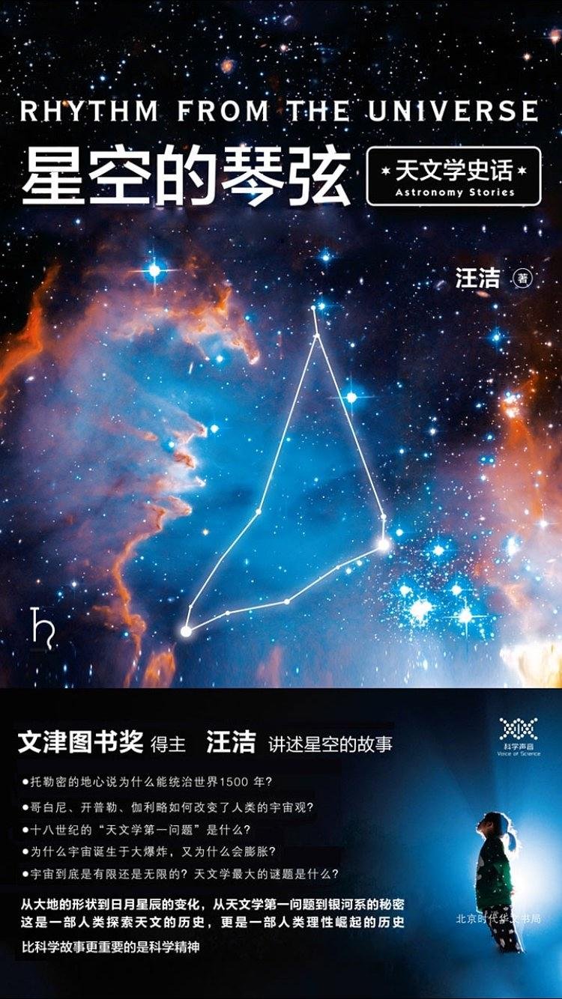
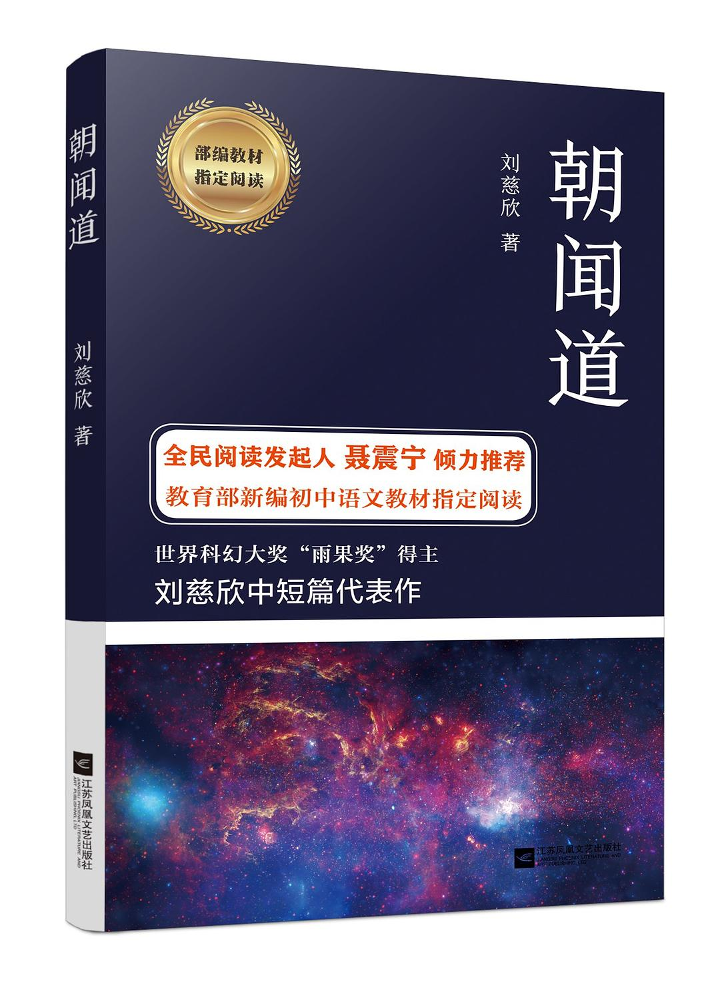
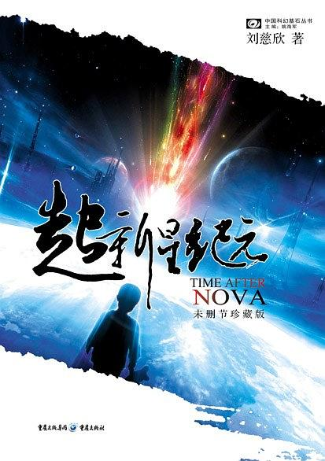

# 2019 书单

!!! warning ""

    :two::zero::one::nine: :point_right::point_right::point_right: :two::zero::two::zero:

    版权说明：本文部分图片素材转载自豆瓣，如涉及侵权，请联系本人。

    内容说明：**部分内容可能涉及剧透。**

----

2019 年的秋天，冬天，似乎格外难熬。

这个世界还会好吗？我们的生活还会好吗？

**在悲伤和沮丧上演的时候，积极、善意、温情和希望也从未缺席。**

2020 年已然将至，迈克尔·柯蒂兹导演的电影《卡萨布兰卡》里有句话说：“如今你的气质里，藏着你走过的路，读过的书和爱过的人。”。

刚要成熟，又要老去。

2019 读过的那些书——读完的 12 本、在读而未读完，却值得推荐的、以及计划在 2020 年要读的。

----

## 2019 书单

!!! tip ""
    
    内容将按读完时间先后顺序介绍，其中推荐指数满星为 5 星。
    
    > 推荐指数也仅基于个人及现如今的心境的评分，并不适用所有人。**So，仅供参考**。

### 1. 刘慈溪《[流浪地球](https://book.douban.com/subject/30455321/)》

推荐指数：3 星

看这本书是起源于年初上映的同名电影。电影相比于原著，电影会相对好看些，虽然剧情内容跟原著基本不搭边。

大多数人应该都对未知充满了渴望。这也包括我。

### 2. 汪洁《[时间的形状](https://book.douban.com/subject/26992254/)》

推荐指数：4 星

“相对论”这个概念经常听到，但一直都不知半解，于是便一探究竟……

内容讲的大多都是科学家发现一些奥秘的内容。每一个成功都是站在巨人的肩膀上。

印象最深的一句话：

> 当一个理论只能”证实“而不能”证伪“，并且也无法作出可靠的预言时，我们暂不能承认它是科学的，而只能当做一种见解去理解。

这就好像：心理学不是科学，只能作为一种学问，它基于长年累月的经验得出一些结论，而且往往很准确，但无法做到 100% 准确。

事实上，科学无法永远证明它是对的，但一旦证明它是错的，那这个理论，便不攻自破。但有时候又不一定如此，就好像牛顿力学的理论无法在狭义相对论中生效，所以有时候，科学又需要在一定的条件下才满足。

### 3. 汪洁《[星空的琴弦](https://book.douban.com/subject/27082359/)》

推荐指数：3.5 星

介绍的更多是天文学的一些发展史和大事件。如果看过《时间的形状：相对论史话》，本书可不看，部分重复。

中国的天文学发展还是较为落后。这主要源于古代帝王，也就是天子，对”天象“观测更多的用于朝代的兴衰预测，为此特别的重视。正因为如此，古代中国拥有世界上最成建制的天象观测机构，且要求极为严苛。不过中国的天文观测记录是世界上最详细、最整齐、最规范的，没有之一。但一直到明清时期，中国的最主流思想依然还是天圆地平，依然认为所有天体都围绕地球转。

这本书印象较深的还是其中一个章节，关于介绍”熵“的短故事，具体内容可查看：《[最后的问题](../201910/final-question.md)》

### 4. 刘慈欣《[朝闻道](https://book.douban.com/subject/27191786/)》

推荐指数：3 星

“宇宙”的目的是什么？朝闻道，夕死可矣...

道可道，非常道；名可名，非常名...

属于看完就忘系列... :joy: :joy:

表达的更倾向一种追求真理的态度。

### 5.  安迪·莱利 《[作死的兔子大全集](https://book.douban.com/subject/26681602/)》

推荐指数：1 星

漫画书，西式的冷幽默，不太适合我。

### 6. 刘慈欣《[超新星纪元](https://book.douban.com/subject/3636385/)》

推荐指数：3.5 星

一次灾难，世界只剩下孩子。

在即将离开孩子的成人眼中，我们该如何放手，该如何让 TA 们面对未知的世界。

在懵懂，心智不成熟的孩子眼中，这样的世界——新鲜、刺激、有趣。面对饥饿，寒冷的时候，又是惊慌失措。他们把战争，当成游戏；武器，是他们的玩具。但孩子的想象力，创造力，却是无限的。

书是 1991 年作者写的，内容在那时候，应该算是很有创意和想象力了。而且基于那时候就能描述出现代的人工智能，算是脑洞很大了。

### 7. 蔡智恒《[夜玫瑰](https://book.douban.com/subject/3140452/)》

推荐指数：3 星

作者痞子蔡，台湾网络小说作家。了解这个人，是因为很久很久很久很久...以前，大概高二吧，读过的第一本小说正是他写的——《[第一次亲密接触](https://book.douban.com/subject/3188320/)》。

《第》的印象还是比较深刻，除了这本书在那个年代很火以外。还因为后来读书的时候，有位语文老师也曾在课堂上提及过这本书，当时她念过里面的一段文字：

> 如果我有一千万，我就能买一栋房子。  
> 我有一千万吗？没有。  
> 所以我仍然没有房子。  
> 如果我有翅膀，我就能飞。  
> 我有翅膀吗？没有。  
> 所以我也没办法飞。  
> 如果把整个太平洋的水倒出，也浇不熄我对你爱情的火。  
> 整个太平洋的水全部倒得出吗？不行。  
> 所以我并不爱你。  

如今回想起来，觉得这样的比喻和排比，看不出任何水平。

《夜》这本书就当是爱情小说看看就好了...因为内容基本忘却了，所以...

总结呢？...

**大部分人的一生，都会有所缺憾，也正因为缺憾，让我们更成熟或是更珍惜一切。**

### 8. 蔡智恒《[槲寄生](https://book.douban.com/subject/26421225/)》

推荐指数：3.5 星

又是痞子蔡的作品，相比《夜》会好不少。当我看完《挪》（下文介绍）的时候，发现这本书应该是作者根据《挪》写的。只不过深度却没有《挪》的好。但也正是因为这本书让我了解到《挪》。

槲寄生——寄生在寄主的一种植物，依靠吸收寄主的水分和无机物生存。如同菜虫寄生在明菁一样，“渣男”一般的存在...

这突然让我想起另外一本书：渡边淳一的《[化身](https://book.douban.com/subject/1097725/)》。

> 事业有成的五十三岁男人秋叶，结识了淳朴而羞涩的乡下姑娘雾子。他教她高雅的着装与谈吐，使她学会享受生活和情爱的愉悦，甚至帮她拥有了独立的事业。雾子在秋叶的精心雕琢下，渐渐蜕变为风情万种的魅力女性。然而，觉醒了的金丝雀还愿意待在笼子中吗？最终，羽翼丰满的小鸟，飞入了自由的天空；而曾经的养鸟人，在一番挣扎之后，也终于放手。

**人生最可悲就是，你教会了我，我也教会了你，而我们，却不能在一起。**

### 9. 村上春树《[挪威的森林](https://book.douban.com/subject/1046265/)》

推荐指数：4.5 星

《挪》应该算是今年读过的最好的一本书，也是力荐的一本。

作者村上春树，写的小说从不直接写自己的经历和体验，也不写家庭。甚至小说中，也不会过多的写主人公的内心世界；更不会直接的表达一些观点。而只是通过事物的发展以及变化，传达内涵。如果非亲身经历或者拥有足够的体验，读他的小说，可能会无法知道小说在传达什么。

> 未完待更

## 未读完值得推荐

## 2020 年

----

秋天在凉，冬天再冷，但总有一日，花会重开，候鸟回头，春至。
