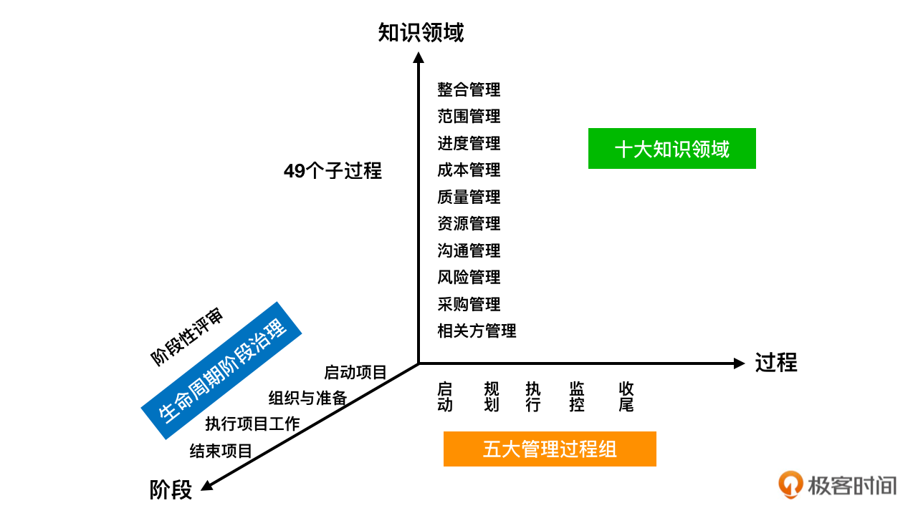
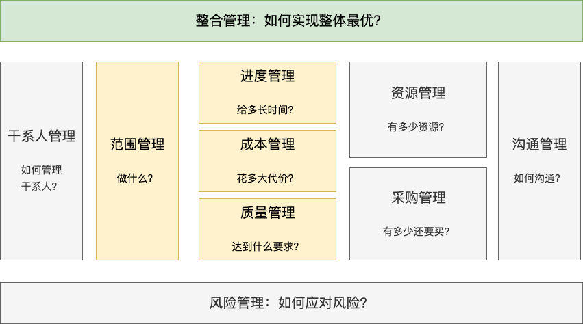
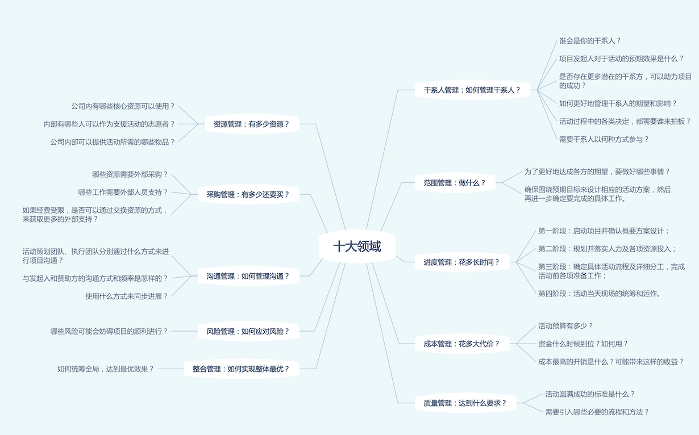

# 常识篇 | 02 十大领域五大过程组（上）：必须要了解的项目管理常识

## 前言

- 好的项目经理不问出身。理论、经验、知识背景都是可以后天培养，而意愿是第一位，其次就是 ==持续不断的学习和刻意训练==。

## 什么是项目管理？

- ==项目管理就是变理想为现实，化抽象为具体的的一门科学和艺术==。
- 《项目管理知识体系指南》由 PMI 组织 200 多名世界项目管理专家，历时 4 年完成。目前演进到第六版。以下是这本书中对项目以及项目管理的**官方定义**：
    - 项目为创造独特的产品、服务或成果而进行的临时性工作。
    - 项目管理就是将各种知识、技能、工具与技术应用于项目活动，以满足项目的要求。
- 项目管理就是把各种系统、方法和人员结合在一起，在规定的时间、预算和质量目标范围内，完成项目的各项工作，对组织资源进行计划、引导和控制。
- PMI 把项目管理分为五大过程组和十大知识领域，共 49 个子过程。

## 项目管理的十大知识领域

- 项目管理的十大领域，将项目管理的工作内容划分为：整合管理、范围管理、时间管理、成本管理、质量管理、人力资源管理、沟通管理、干系人管理、风险管理和采购管理。
- 其中 ==进度、成本、质量、范围是 4 个核心领域，风险、沟通、采购、资源、干系人管理是 5 个辅助领域和 1 个整体领域==。如图：

    

- **快速、完整有效的分析思考的十个角度**
    - 干系人管理：如何管理干系人
        - 那些是你的干系人？项目发起人的预期效果是什么？
        - 如何增进团队的协作，如何提升凝聚力等？
        - 发现更多潜在的干系方，如：可助力项目成功进行的人？
        - 分析完干系方后，还需要思考，如何更好的管理干系人的期望和影响？活动的各项决定，由谁来拍板？干系人以什么样的方式参与？
    - 范围管理：做什么？
        - 划定交付的范围。搞清楚到底要做那些事。
        - ==确保围绕着预期目标来设计相应的活动方案==。确定活动前、活动中、活动后分别要完成的具体工作。
    - 进度管理：花多长时间？
        - 规划好阶段性步骤，同时明确每个里程碑的目标成果和时间安排。
        - 活动可以按四个阶段来进行：
            - 第一阶段，启动项目并确认概要方案设计；
            - 第二阶段，规划并落实人力和各项资源的投入；
            - 第三阶段，确定具体的活动流程和详细分工，完成活动前的各项准备工作；
            - 第四阶段，做好活动当天的统筹和运作。
    - 成本管理：花多大代价？
        - 预算有多少？
        - 资金是否到位？
        - 预算中成本最高的开销是什么？
        - 投入所带来的的收益？
        - 从全局视角去思考，如何更有效地管理项目的各项投入，以达到更加匹配目标的预期效果。
    - 质量管理：达到什么要求？
        - 确定活动成功的标准？
        - 思考需要使用那些流程或方法，以保障效果的达成。
    - 资源管理：有多少内部资源？
        - 有哪些核心资源可使用？
        - 有哪些志愿者支援？
        - 公司/部门能提供什么？
    - 采购管理：有多少还要买？
        - 除了可确定的公司资源，思考哪些是外部采购？哪些需要外部资源协助支持？
        - 如经费有限，是否可通过交换资源，获取更多的外部支持？
    - 沟通管理：如何管理沟通？
        - 以什么方式进行沟通？以什么的频率沟通？
        - 如何保持团队内外项目信息的高效传递？使用什么方式同步进展？
    - 风险管理：如何应对风险？
        - 思考哪些会影响活动的正常举行？如：外界因素，内部因素？
        - ==提前做好系统性的风险识别，分等级制定应对策略==。
    - 整合管理：如何实现整体最优？
        - 如何统筹全局，整合并协调各环节的利益冲突和工作安排？
        - 不断变化的情景下，如何根据目标“裁剪”出合适的过程、方法和工具。采用有效的管理，从而达到全局的最优效果。

## 总结

- 项目管理的职责定位：==保目标，助决策，提效能，促协作==。