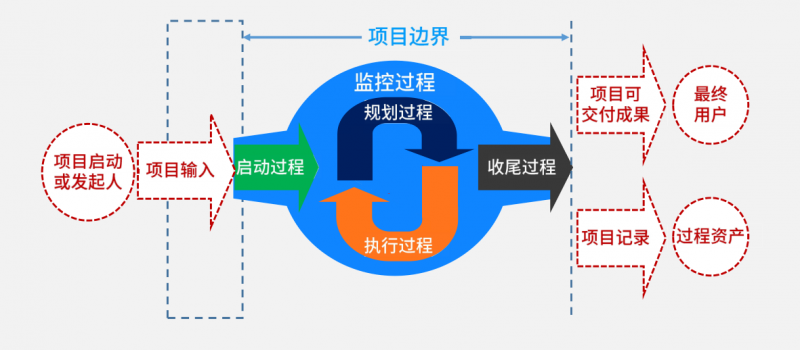
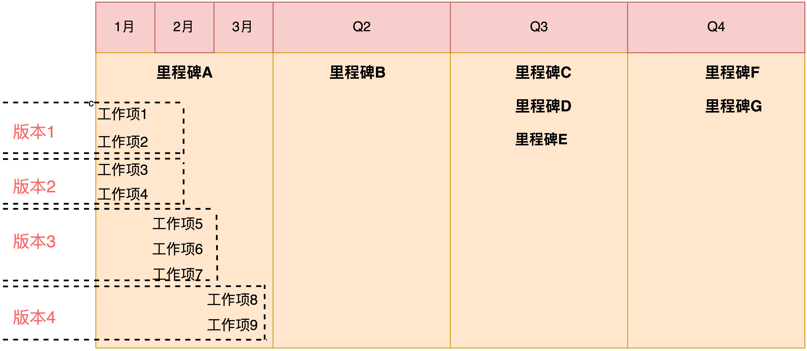
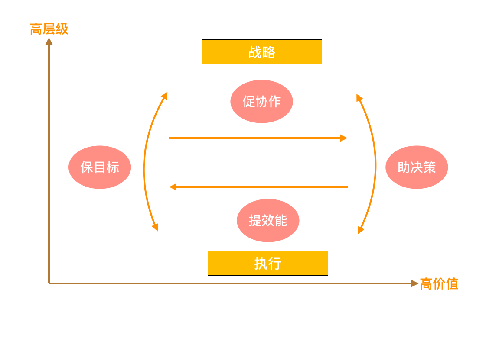
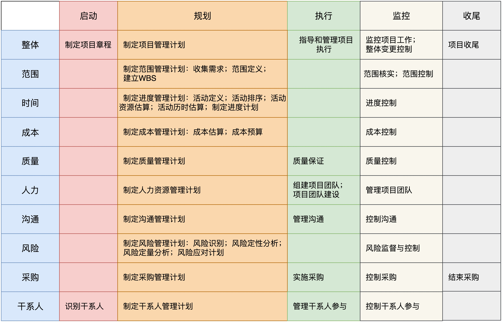

# 常识篇 | 03 十大领域五大过程组（下）：必须要了解的项目管理常识

> 发布时间：2019-11-10 13:40:54

## 前言

- PDCA 循环：最早来自质量管理领域，意思做任何事，都要经过 ==规划（Plan）、执行（Do）、检查（Check）和行动（Act）== 四个步骤，又称戴明环。
    - 这个循环不是运行一次，是周而复始、螺旋上升的。
    - 越简单的东西，越是 ==普适== 的。
- PMI 遵循 PDCA 的法则，将项目管理活动分成了五大过程组： ==启动过程组、规划过程组、执行过程组、监控过程组和收尾过程组==。如下图所示：

    

## 项目管理的五大过程组

1. 启动过程组（千里之行，始于足下）
    - 启动过程组意味着正式开始一个项目，或者是开始一个项目中的新阶段，包括 ==识别干系人和制定项目章程== 两个子过程。
    - 项目目推进困难，配合意愿不高的常见疑问：
        - 项目的整体愿景是什么？
        - 做这些任务，是为了达成什么目标？
        怎么才能把这些任务和现有的工作安排的很协调- 呢？
        - 他们看不到项目整体，只是在完成一条条具体的任务。
    - 更有效率的方式是什么？
        - 启动一个新项目或新阶段时，首先要建立项目章程，并且通过启动会去公开确认。
        - 启动会的作用：==正式宣告一个新项目和新阶段的开始，公开确认项目章程，包括明晰各方干系人的期望和诉求，设定愿景目标和重要里程碑，确定责任分工和沟通机制等==。
    - 涉及跨部门的项目，启动会的重要性
        - 可邀请更高的管理层出面，讲清楚项目的背景、目标和重要性。
    - 启动会也是项目管理人员获得 ==公开授权== 的有效方式，可以在之后的推进工作更容易开展。
2. 规划过程组（运筹帷幄，决胜千里）
    - 规划就是把愿景目标转化为可落地的行动方案和工作路线。对规划过程组进行有效的管理，可更容易获得干系人的认可和参与。
    - 根据预期目标，明确项目范围，确定项目的里程碑阶段目标，为项目执行做好各项准备。
    - 对于复杂的项目，规划通常是一个渐进明晰的过程。==近期规划往往是具体的==，需要拆分到具体版本和工作项目；而 ==远期规划则相对比较模糊==。随着收集和掌握的信息增多，规划也需要 ==动态细化，不断更新==。如图所示：

        

3. 执行过程组（言出必行，行之必果）
    - 执行力，重在 ==整合资源，推进项目落地==，完成想管理计划中确定的工作以实现项目目标。
    - 如果在启动和规划环节做好了，在执行环节，反而会更轻松一些。而你的工作只需要更侧重于确保项目一直在正确的轨道上，确保各个环节按照规划进行，并且能够真正做到位。
4. 监控过程组（审时度势，沉着应变）
    - 当外界环境或内部要求发生变化是，项目管理者要审时度势，沉着应变，适时地调整各方，以更好地实现目标。
    - ==需要定期对项目的进展、范围、质量等进行跟踪和监控，识别目前的进度与计划之间的偏差，从而快速准确的采取办法进行纠正和调整。==
5. 收尾过程组（慎终如始，则无败事）
    - 交付项目成果，组织团队的 ==回顾复盘，归档所有文档等组织过程资产== ，正式结束一个项目或阶段。
    - 所谓慎终如始，则无败事。重要的事情说三遍：“复盘！复盘！复盘！”不管项目成功与否，==“趁热”复盘== 都是极为重要的一步。
    - 复盘不光只会复盘正常结束的项目，对于中途被叫停的非正常“死亡”项目，我们会格外重视，并立即复盘。
        - 我们把这种复盘称为“验尸会”。
        - 通常这样的复盘会给我们带来很多 ==有价值的信息和启示==，比如哪些致命风险需要一开始就被很好的管理和应对，再来一次的话，我们该如何做。

## 互联网项目管理的职责定位
 
- 对于大多数互联网产品而言，研发期和运营期是交织一起的，并非像传统项目那样有个清晰的项目交付目标和时间周期。这种海浪式的迭代演进过程，需要基于实际的场景，找到对应的颗粒度下的 PDCA 闭环管理方法。
- 基本纲领：“ ==保目标、助决策、提效能、促协作== ”。

    

    - 从纵向看：战略到执行的过程中，项目管理的两项职能是保目标和助决策，这形成了一个环绕目标驱动的闭环。
        - 战略意图，清晰的反应到每个人每一天的执行中。
        - 通过清晰而系统的反馈机制和平台，把执行的进展状态、变更、风险等集中呈现，以帮助管理者更好的进行优化和调整。
    - 从横向看：提效能和促协作，本质上都是工作在上下游跨角色协同的这条线上，链条越长，协同就越是复杂。
        - **提效能是要关注和消灭团队中的低价值工作所引发的效能痛点。**
            - 如：测试环境部署较长，成为团队的瓶颈，则一个个想办法通过技术手段实现自动化，从而为整条链路提速。
        - **促协作是着眼于使用各项项目管理方法和工具，让高价值工作者可以更好的工作。**
            - 如：建立清晰有效的信息渠道和沟通机制，积极推动各角色达成共识等。
        - 总结：==保目标、助决策是要打通从战略到执行的闭环，提效能、促协作是打通上下游协同的闭环。==

## 总结

