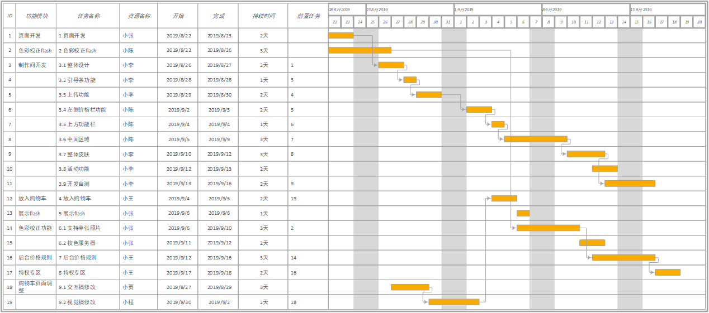

# 硬技能篇 | 02 规划：排除计划中的“延期地雷”

> 发布时间：2019-11-17 14:46:52

## 前言

- 很多程序员根本不做估算的原因，归结为一个：**嫌麻烦**。
- 为什么要做计划？
    - 在项目管理中，==计划是贯穿始终的重要课题，是各个角色协同工作的基准==。
    - 从全局的视角出发，==去推进项目整体目标的落地，优化各个角色的协同过程==。作为项目经理，你要 ==利用一切可以利用的资源、尽自己最大的努力达成项目目标==，而- 计划就是可借助的重要工具。
- 计划到底是什么？用来做什么的？
    - 计划是“市场需求或发起人的期望”和“团队生产力”之间平衡的结果。
    - 从本质上来讲，==计划是用来对焦的！做计划，是个集体对焦的过程==。

## 雷区1：不够具体

- 第一份计划：常见（不规范）的“一句话式”计划（基本约定，规定提测和上线时间）
如：网课 2.0 升级项目计划于 9 月18 日提测，10 月1 日正式上线。
- 好的计划，不仅要 ==给出时间节点，还要给出依据和来源，这样才能更有效的对焦==。
- 做计划的第一个标准动作。概念：==WBS 工作分解（Work Breakdown Structure）==
    - 创建 WBS 的过程，也就是把项目工作 ==按阶段可交付成果分解成较小的、更易于管理的组成部分的过程==。
    - 我们要做的这件事真正拆解开，明确要 ==分成多少块工作内容，涉及哪些角色和哪些环节的工作项== ，你需要将工作项拆解到 3 个工作日以内，每项任务都对应到个人。
- 第二版计划：  
    
- 做计划的方式的转变，背后起是 ==思维方式的转变==
    - ==工程师的目标是完成开发任务。但当职责扩大到项目经理的时候，本能把目标也默认设为完成一堆开发任务，但需要意识到，作为项目负责人，自己还需要做些什么==。

## 雷区2：不够全面
 
- 项目管理是运用当前的一切可用资源，去完成整个项目目标。
- 如上文讲述的第二版计划最大的问题：**只有任务列表，没有识别关键资源和关键依赖，也没有考虑研发之外的其他环节。**
    - 这样的计划，无法让我们明确实现目标的关键路径，也无法明确是否可以完成目标以及如何完成。
- ==识别依赖并画出关键路径==，就是我要讲的做计划的第二个标准动作，这一步意味着我们开始从目标的角度对资源进行统筹思考。
    - 关键路径是决定项目工期的进度活动序列。它是项目中的最长的路径，==关键路径的工期决定了整个项目的工期==。所以，任何关键路径上的延迟，都将直接影响项目的预期完成时间。
- 第三版计划：  
    
- ==清晰关键路径后，我们要对其进行持续关注，把关键路径上的风险作为最高优先级应对。==
- 除此之外，在核心部分计划出炉后，还要 ==对项目涉及的其他合作环节，进行全面的规划和安排，为各个阶段设定合理的里程碑节点== ，确保考虑周全。
- 其他合作环节参考图示：  
    
- 建议使用 ==Visio 工具==，把整个过程可视化出来，让计划更加直观：  
    

## 雷区3：不够准确

- 执行总出现的问题和纠纷，大多是 ==因为大家对一些节点的定义理解不一致==，如：
    - 什么叫提测，什么叫里程碑完成
    - 我从没说过 XX 号完成交付，我说的是 XX号完成研发
- 做计划的第三个标准动作，就是 ==定义完成标准==。
    - 完成标准就是 ==某时间点需要完成的事项列表，或者是应该达到的某项指标（特定水平的 Bug 数量 / 性能指标等）==
    - 进度计划中的 ==任何重要时间节点，都应该有一组完成标准==。
    - 越 ==早== 定义完成标准，计划按照期望完成的概率就越大。
- 以关键的几个常见时间节点为例，完成标准如下：
    - **需求 / 设计确认：** 执行所需的需求稿或设计稿已经完成，而且公开评审通过，团队已经准备好要编写产品代价。值得一提的是，还有些团队还会对需求稿或设计稿做一定的要求，比如**把未处理的反馈意见数小于多少作为标准**。
    - **功能完成 / 提测：** 所有定义的功能都已经完成（比如冒烟测试通过率高于90%），团队已经准备好将焦点转移到质量保证上，并将剩余问题当做bug来跟踪。一些质量基础较好的团队，可通过 **CI 自动回归用例通过率、静态代码检查分数、单元测试覆盖率** 作为更加具体细节的完成标准。
    - **里程碑完成：** 质量已经达到适当水平（如不存在 P0 及 P1 优先级的 Bug），可以上线发布，或者开始下一个里程碑。

## 雷区4：没有共识

- 常见 **认知问题** ： ==“做”了一份计划，而不是在“做计划” ==
    - 进度计划的文档只在自己的电脑，在执行的过程中，只是和几个开发口头说过。并未任何公开的方式发布过，甚至都没有发邮件、公告等于全员同步信息，更别说专门的规划会议。
- ==没有达成共识的计划，是不具备任何效力的。==
    - 在全员规划会议上，除了对其信息之外，更重要的是 ==当面达成共识==，这其实也是 ==仪式感和承诺的象征==，对计划后续的有效执行，是至关重要的。
    - 因此，==达成共识并公开透明==，就是做计划的第四个标准动作。

>  **强烈建议：** 至少在确认计划之后，向所有的项目组成员，包括项目的所有干系人，==发送计划邮件==，正式周知，这可以尽早的发现共识的偏差。

## 雷区5：不够即时

- 计划就像冰箱里的酸奶，即时的，才是有效的。
- 在整个项目周期中，由于随时会可能出现变更，加上对估算的不断细化，==做计划永远是个反复修正、渐进渐明的过程，我们要对计划进行持续的跟进与调整。重要的是，每一次进行调整，都要确保项目中的每个人知道当前的计划是什么，调整计划需要怎样的决策过程，都需要谁参与决策。==
- ==即时调整变更==，就是做计划的第五个标准动作。

> **注意：** 与进度计划有关的任何变更，都需要提交给项目管理人员，最好由团队中对应的功能小组成员（该功能模块涉及的策划、涉及、开发、测试）及其他相关干系人员共同讨论，明确计划变动可能对各方造成的影响，最终做出决策，并公开告知所有项目组成员。

## 总结

- 五个标准动作
    - ==WBS 工作分解==
    - ==识别依赖及规环节关键路径==
    - ==定义完成标准==
    - ==达成共识并公开透明==
    - ==即时调整变更==

