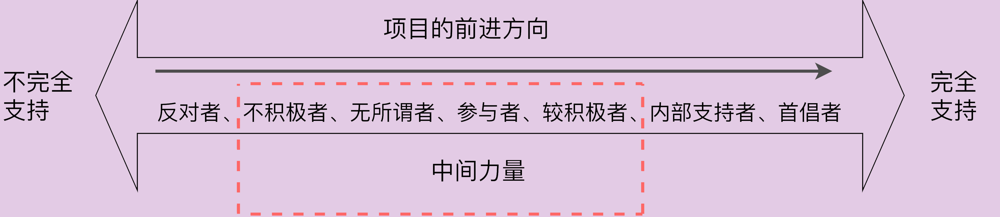
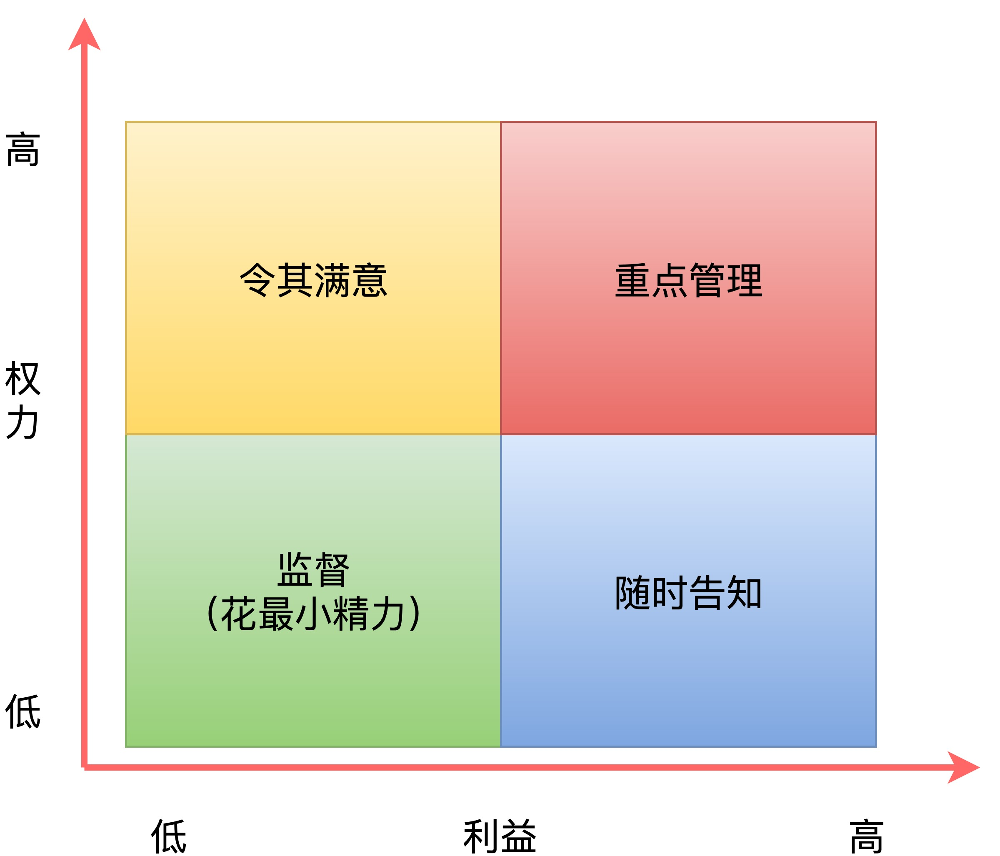
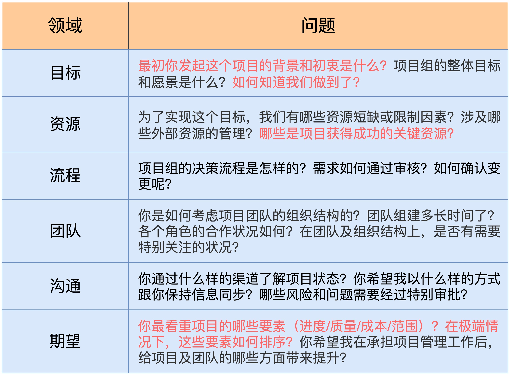
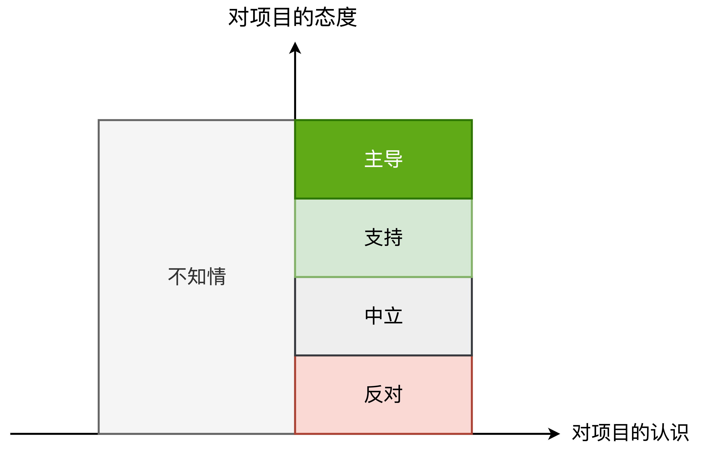
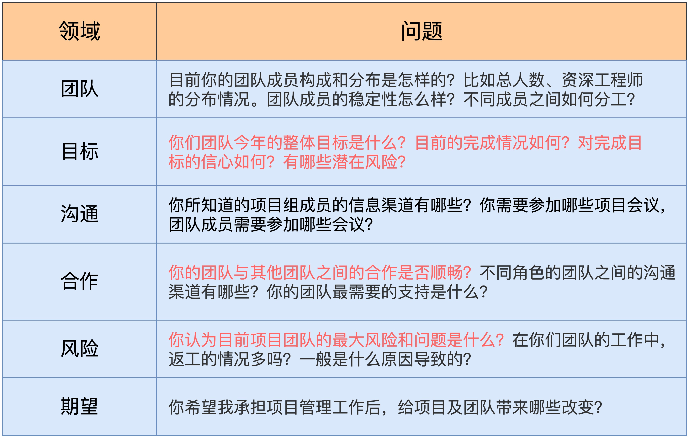
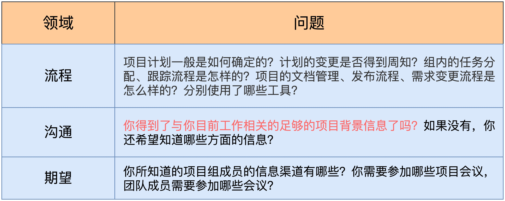
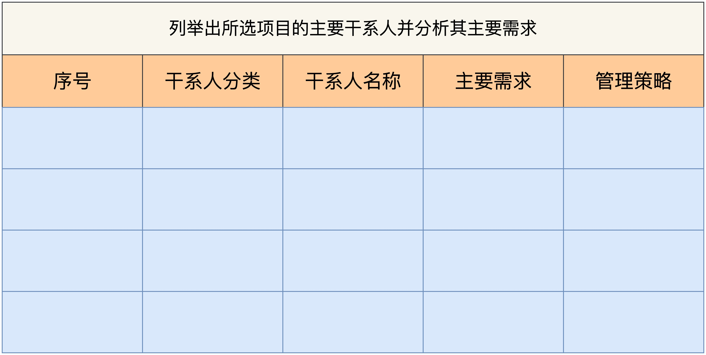

# 硬技能篇 | 01 启动：识别项目中的四类干系人

> 发布时间：2019-11-13 00:31:58

## 前言

- 干系人分析：是指对项目干系人进行分析和归类，有针对性地规划管理器核心诉求和期望，让干系人可以更好地参与项目，对项目产生积极影响，从而更好的保障项目目标的成功达成。
- 干系人分析的目的：
    - 毛泽东说过一句话：“ ==要把拥护我们的人搞得多多的，把反对我们的人搞得少少的。== ”
    - 作为项目管理人员，你需要通过积极的干系人管理，尽可能把反对的力量变成支持的力量，同时发掘和调动中间力量。  
        
    - 需要深入的了解 ==项目的现状以及各方干系人对项目的期望和诉求==，因地制宜的采取相应的策略，才能做到有的放矢。
- 按照在项目上的 ==权力和利益== 相关度对干系人划分：
    - 高利益-高权力
    - 高利益-低权力
    - 低利益-高权力
    - 低利益-低权力

    

## “高利益-高权力”代表：项目发起人

- 《项目管理知识体系指南》把项目发起人称为 Sponsor，即项目资助人。
    - 项目发起人会 ==定义组织的需求，为项目提供资金支持，并进行人员配备==。
    - 一般来说，项目发起人天然会成为你 ==强有力的支持者，需要重点管理==。
- 了解发起人对项目的 ==真正诉求==，可以向发起人了解以下参考：
    - 项目真正要的是什么？
    - 这个项目能为组织带来什么？
    - 组织对项目成功的定义是什么？
- 对发起人做一轮全面而深入的了解，是非常有必要的。可参考的问题列表：  
    
- 为了管理好之后的沟通，还需要 ==约定好与发起人沟通频率和方式== ，以便在项目进行的过程中做好实时同步。比如：
    - 每周用邮件同步项目的进展和风险问题、建立核心微信群实时交流、每月至少进行一次深入面谈等。

## “低利益-高权力”代表：职能经理
 
- 在矩阵式组织结构中，职能经理是资源池的所有者
    - 所管辖的团队覆盖多个项目，使得与单个项目的利益相关度通常较低，介入程度也会有限。
    - 但对 ==资源的把控能力很强== ，如果管理不好这类干系人，项目资源就很容易受到影响。
- 案例展示（推荐）
    - 有段时间，团队一再跟我抱怨，这个项目中的设计资源成了最大的瓶颈，于是我决定去拜访一下那位传说中性格乖张、超难合作的设计经理。见面后的前半个小时，他一直在跟我抱怨：“项目进度压得太紧，我的很多设计师都累病了；产品和开发对设计师们太不友好了，产品没有经验，连需求都说不清楚；开发实现得还原度太低，问题一箩筐……”
    - ==我没有反驳他，而是把他的话一条条地记录了下来。半个小时之后，我给他看我记的内容，耐心地跟他一一确认，他想要表达的是不是我所记录的意思。== 看到我认真的笔记，他的态度明显缓和了。
    - 经过一番梳理，我发现，他之所以排斥这个项目，是因为他觉得在这个项目中，设计师没有太多发挥的空间。于是，我问他：“ ==咱们设计团队今年最想做的事是什么？这个项目怎样才能更好地支持你和你的团队呢？== ”这个问题瞬间打开了他的话匣子，他兴致高昂地跟我描绘了他的期望。这次交流，让我们找到了更多深度契合的合作点。
    - 随着合作的深入，这位经理从一个抵制者慢慢变成了项目的坚定支持者。他调动了资深的设计师来支持这个项目，并且主动发起了 Logo 和界面主风格改版的创意评选活动，把项目的设计品质提升了一大截，这给项目组带来了非常正向的影响。
- 想让干系人的态度发生转变，最重要的就是弄清楚他抵制的原因。==强烈的态度背后，一定反映了干系人对现状的某种认知==。
    - 这种认知未必是事实，但一定不要急于反驳，而是 ==不带评判的了解他的内心想法，通过积极聆听去建立信任==。
    - 只有真正的理解了对方的逻辑，才有可能进一步对其施加影响。
- 根据对项目的认知态度，细分为三类，进行差异化管理：
    
    - 反对者（红色部分）：最难处理的一类。管理这类人的重点在于 ==建立信任，化解敌意== 。如果实在无法争取他们的支持，至少要让他们保持中立，以免对其他成员造成负面影响。
    - 支持者（绿色部分）：是项目获得成功非常需要依赖的力量。管理这类人，==需要明确的知道，他们各自对项目的不同期望和诉求，然后有意识的创造更多的空间和机会，让他们能够深度参与到项目的决策或创意环节== 。这样可以增强他们的主人翁意识，也会给整个项目组带来最大的利益。
    - 中立者（灰色部分）：总体原则是，在条件合适的情况下，进一步将其 ==转化为支持力量==。如果精力有限，可暂时 ==维持现状==。
    - 对这类干系人的进一步了解，可参考的问题列表  
        

## “高利益-低权力”代表：项目组成员

- 这是与项目结果直接相关，但对决策影响不大的一类人。
- 可以借助三类问题，了解流程的基本情况和成员的信息诉求。以帮助你了解项目的规划和实施过程，找出没有做到位的地方，弄清楚成员当前最希望通过项目管理看到的变化。  
    
- 管理这类干系人的核心，就是要做到 ==项目事项的随时告知，及时通报项目的进展和困难==。

## “低利益-低权力”代表：外围支持人员

- 通常会把一些 ==复杂度低，而且非核心== 的工作，转交给外围支持人员，比如设计外包，技术外包人员等。在 ==不影响项目== 的前提下，可以 ==花最小的力气对他们进行监督==。
- 比如：可以提前约定好，每天或者每周进展汇报的格式和内容，确保他们的工作职责和任务明确，进展符合预期。

## 总结

- 学习识别项目干系人
- 四象限的干系人分析法，相当于一个知道原则，可以帮助你明确的管理每一类人的预期。
- 建议你对典型的干系人进行分类和访谈，深入的了解干系人的核心体系（ ==重点关注哪些，对项目有哪些预期== ），从而制定出 ==合理的干系人沟通管理计划（包括频率、方式、内容）==。

## 实践

结合实际的项目情况，制作一份干系人分析表。针对每一类干系人的管理策略是什么？

