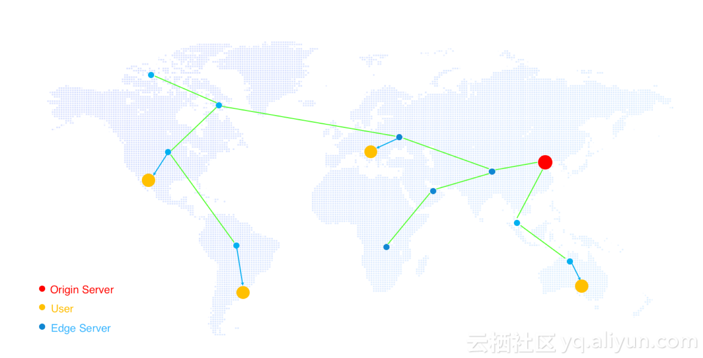

# CDN 科普

## 含义

CDN 的全称是 Content Delivery Network，即内容分发网络。CDN 是构建在网络之上的内容分发网络，依靠部署在各地的边缘服务器，通过中心平台的负载均衡、内容分发、调度等功能模块，使用户就近获取所需内容，降低网络拥塞，提高用户访问响应速度和命中率。CDN 的关键技术主要有内容存储和分发技术。

—— 摘自《[百度百科](https://baike.baidu.com/item/CDN/420951)》

名词解释：

- Origin Server：源站，源服务器
- User：访问者
- Edge Server：CDN 的服务器

## 原理

### 流程图

### 缓存策略

## 边缘计算

### 什么是边缘计算

> 图片来源 AWS 

### 实例说明：静态资源加速

> 这个大家都懂，就不细说 :smile::smile:

### 实例说明：后端加速（缓存）—— 自定义缓存时间

- http://cdn-tests.flc.io/

!!! tip ""

    对于动态文件（eg：php | jsp | asp），建议设置缓存时间为 `0s`，即不缓存；若动态文件例如 php 文件内容更新频率较低，推荐设置较短缓存时间

    —— 摘自《[阿里云说明文档](https://help.aliyun.com/document_detail/27136.html?spm=5176.11785003.domainDetail.6.7d79142fpxRL9k#h2-url-2)》

**参考文档：**

- 服务器端设置过期时间：https://help.aliyun.com/knowledge_detail/40080.html?spm=a2c4g.11186623.2.12.33ad45e56FKahB

### 实例说明：WEBP 原理

## 其他

### CDN 自带应用（常见）

- 页面优化：去除HTML页面页面冗余内容如注释以及重复的空白符
- 智能压缩：对静态文件类型进行压缩, 有效减少用户传输内容大小
- 访问控制：Refer防盗链、IP 黑/白名单等
- 自定义页面：支持设置404、403、503、504等页面
- 自定义 header 头：如 `Access-Control-Allow-Origin: *` 以实现跨域

### 其他应用

- AWS：Lambda

--------------------------------------

## 含义

CDN 的全称是 Content Delivery Network，即内容分发网络。CDN 是构建在网络之上的内容分发网络，依靠部署在各地的边缘服务器，通过中心平台的负载均衡、内容分发、调度等功能模块，使用户就近获取所需内容，降低网络拥塞，提高用户访问响应速度和命中率。CDN 的关键技术主要有内容存储和分发技术。

## 名词解释

- CDN
- Lambda
- S3

## 原理

## 优势

## 边缘计算

## 常见应用

- 静态资源加速
- webp 图片

## 联想

- 动态程序缓存