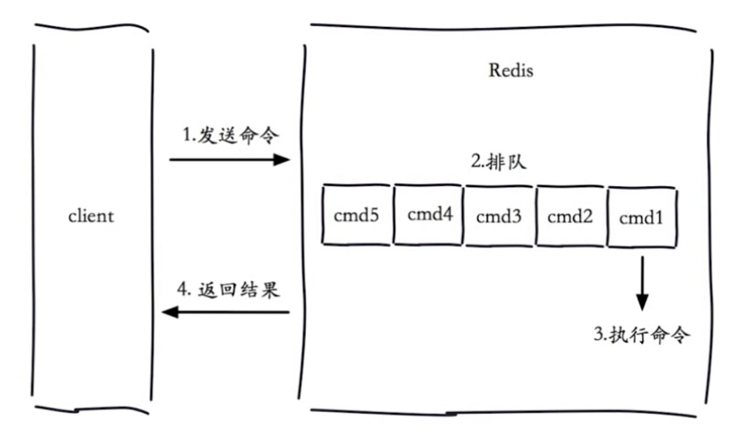

# Redis 慢日志

## Redis 生命周期

**总结：**

- 因 Redis 的单线程机制，命令的执行是排队机制；
- 当某个命令慢速，将会导致后续的所有命令等待排队；
- 慢查询发生在如图示的第 3 阶段，即：单个命令的执行过程；
- 客户端超时不一定是慢查询；但慢查询是导致超时的一个因素之一。

## 慢查询的配置

### 配置介绍

#### slowlog-max-len

慢查询日志记录条数

- 先进先出队列
- 固定长度
- 保存在内存内
- 超过长度部分，自动清除

#### slowlog-log-slower-than

慢查询阈值（单位：微秒）

- `slowlog-log-slower-than=0`，记录所有命令为慢查询
- `slowlog-log-slower-than<0`，不记录任何命令

### 配置方法

#### 默认值

- slowlog-max-len=128
- slowlog-log-slower-than=10000

> 获取方式：`config get ***`；如：`config get slowlog-log-slower-than`

#### 修改配置

- 方法一：永久生效：修改配置文件后重启服务
- 方法二：动态配置（重启后失效）：`confit set ***`，如：`config set slowlog-max-len 1000`

## 慢查询命令

- `slowlog get [n]`：获取慢查询日志数据，`[n]` 为条数
- `slowlog len`：获取慢查询日志总条数
- `slowlog reset`：清空慢查询日志

## 运维经验

- `slowlog-max-len` 不建议设置过小，默认值 128，通常设置为 1000 左右
   - 可基于日常排查异常设置
- `slowlog-log-slower-than` 不建议设置过大，默认 10 ms，通常设置为 1 ms
   - 可基于期望 QPS 参考设置阈值
- 理解 [Redis 生命周期]，理解慢查询出现的原因
- 定期持久化慢查询日志，如：存储到 MySQL，便于后续排查问题
   - 因 `slowlog-max-len` 的原因，超过指定数量的日志，会自动清除