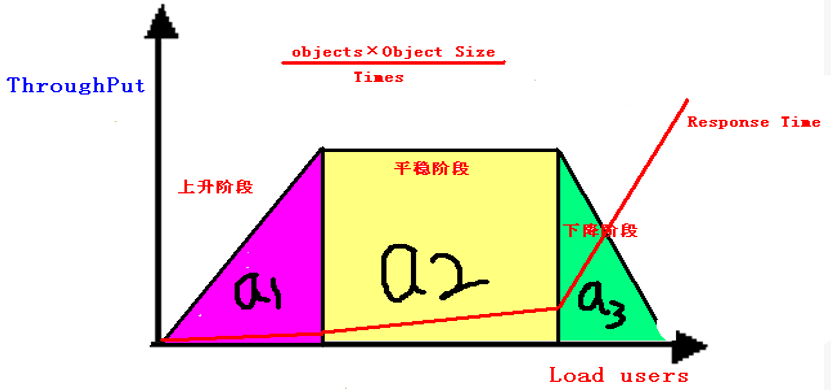

# 入门

## 常见术语

### 吞吐量

指在一次性能测试过程中网络上传输的数据量的总和，也可以这样说在单次业务中，客户端与服务器端进行的数据交互总量；

对交互式应用来说，吞吐量指标反映服务器承受的压力，容量规划的测试中，吞吐量是重点关注的指标，它能够说明系统级别的负载能力，另外，在性能调优过程中，吞吐量指标也有重要的价值；

**吞吐量和负载之间的关系：**

- 上升阶段：吞吐量随着负载的增加而增加，吞吐量和负载成正比；
- 平稳阶段：吞吐量随着负载的增加而保持稳定，无太大变化或波动；
- 下降阶段：吞吐量随着负载的增加而下降，吞吐量和负载成反比；

> 总结：吞吐量干不过负载！！！

如图所示：

> a1 面积越大，说明系统的性能能力越强；a2面积越大，说明系统稳定性越好；a3面积越大，说明系统的容错能力越好。

### 吞吐率（`Requests per second`）

服务器并发处理能力的量化描述，单位是 `reqs/s`，指的是 **某个并发用户数下单位时间内处理的请求数**。某个并发用户数下单位时间内能处理的最大请求数，称之为最大吞吐率。它是衡量网络性能的重要指标

**吞吐率是基于并发用户数的。** 这句话代表了两个含义：

> 1：吞吐率和并发用户数相关；
> 2：不同的并发用户数下，吞吐率一般是不同的。

计算公式：总请求数 / 处理完成这些请求数所花费的时间，即
`Request per second = Complete requests / Time taken for tests`

### 并发连接数（The number of concurrent connections）

并发连接数指的是某个时刻服务器所接受的请求数目，简单的讲，就是一个会话。

### 并发用户数（The number of concurrent users，Concurrency Level）

要注意区分这个概念和并发连接数之间的区别，一个用户可能同时会产生多个会话，也即连接数。在 `HTTP/1.1` 下，IE7 支持 2 个并发连接，IE8 支持 6 个并发连接，FireFox3 支持 4 个并发连接，所以相应的，我们的并发用户数就得除以这个基数。

### 用户平均请求等待时间（`Time per request`）

计算公式：处理完成所有请求数所花费的时间/(总请求数 / 并发用户数)，即 `Time per request = Time taken for tests /（ Complete requests / Concurrency Level）`

### 服务器平均请求等待时间（`Time per request: across all concurrent requests`）

计算公式：处理完成所有请求数所花费的时间 / 总请求数，即 ` Time taken for / testsComplete requests`。可以看到，它是吞吐率的倒数。

同时，它也等于用户平均请求等待时间/并发用户数，即 `Time per request / Concurrency Level`

## 参考文档

- 性能测试常见术语浅析——吞吐量与吞吐率：https://www.cnblogs.com/qiaoli0726/p/10007048.html
- 使用ab进行压力测试
：https://www.jianshu.com/p/33a8121e079c