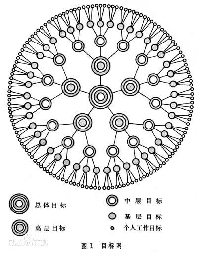
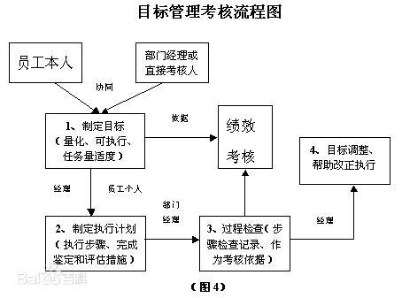

# SMART 原则

> 发布时间：2020-01-24 16:09:35

!!! tip "说明"

    本文基于[百度百科](https://baike.baidu.com/item/SMART%E5%8E%9F%E5%88%99/8575850?fr=aladdin)进行整理，几乎95%以上转载，主要用于记录学习，进行二次整理所得。

    > 另附 XMIND 下载，[传送门](assets/Smart 原则.xmind)。

## 基础

### 基础概念

SMART 原则（S=Specific、M=Measurable、A=Attainable、R=Relevant、T=Time-bound）是为了利用员工更加明确高效地工作，更是为了管理者将来对员工实施绩效考核提供了考核目标和考核标准，使考核更加科学化、规范化，更能保证考核的公正、公开与公平。

### 原则解释

- 绩效指标必须是具体的（Specific）
- 绩效指标必须是可衡量的（Measurable）
- 绩效指标必须是可达到的（Attainable）
- 绩效指标是要与其他目标具有一定的相关性（Relevant）
- 绩效指标必须具有明确的截止期限（Time-bound）

### 特别注明

- S 代表具体（Specific），指绩效考核要切中特定的工作指标，不能笼统
- M 代表可度量（Measurable），指绩效指标是数量化或者行为化的，验证这些绩效指标的数据或信息是可以获得的
- A 代表可实现（Attainable），指绩效指标在付出努力的情况下可以实现，避免设立过高或过低的目标
- R 代表相关性（Relevant），指绩效指标是与工作的其他目标是相关性的；绩效指标是与本职工作相关联的
- T 代表有时限（Time-bound），注重完成绩效指标的特定期限。

## 五大原则

### 明确性

明确就是要用具体的语言清楚地说明要达成的行为标准。明确的目标几乎是所有成功团队的一致特点。很多团队不成功的重要原因之一就因为**目标定的模棱两可**，或**没有将目标有效的传达给相关成员**。

> **示例：** 目标——“增强客户意识”。这种对目标的描述就很不明确，因为增强客户意识有许多具体的做法，如：减少客户投诉，过去客户投诉率是3%，把它减到1.5%或1%。提升服务的速度，使用规范礼貌的用语，采用规范的服务流程，也是客户意识的一个方面。
> 
> 有这么多增强客户意识的做法，我们所说的“增强客户意识”到底指哪一块？不明确就没有办法评判、衡量。我们建议这样修改，比方说，我们将在月底前把前台收银的速度提升至正常的标准，这个正常的标准可能是两分钟，也可能是一分钟，或者分时段来确定标准。

**实施要求：** 目标设置要有**项目、衡量标准、达成措施、完成期限以及资源要求**，是考核人能够很清晰的看到部门或科室月计划要做哪些事情，计划完成到什么样的程度。

### 衡量性

衡量性指目标是应该是明确的，而不是模糊的。应该**有一组明确的数据**，作为衡量是否达成目标的依据。如果制定的目标没有办法衡量，就无法判断这个目标是否实现。比如领导有一天问“这个目标离实现大概有多远？”团队成员的回答是“我们早实现了”。这就是领导和下属对团队目标所产生的一种分歧。原因就在于没有给他一个定量的可以衡量的分析数据。但并不是所有的目标可以衡量的，有时也会有例外，比如说大方向性质的目标就难以衡量。

> **示例：**比方说，“为所有的老员工安排进一步的管理培训”。进一步是一个既不明确也不容易衡量的概念，到底指什么？是不是只要安排了这个培训，不管谁讲，也不管效果好坏都叫“进一步”？
>
> **改进一下：**准确地说，在什么时间完成对所有老员工关于某个主题的培训，并且在这个课程结束后，学院的评分在85分以上，低于85分就认为效果不理想，高于85分就是所期待的结果。这样目标就变得可以衡量。

**实施要求：**目标的衡量标准遵循“**能量化的质化，不能量化的感化**”。使制定人与考核人有一个统一的、标准的、清晰的可度量的标尺，杜绝在目标设置中使用形容词等概念模糊、无法衡量的描述。对于目标的可衡量性应该首先从**数量、质量、成本、时间、上级或客户的满意程度**五个方面来进行，如果仍不能进行衡量，还可以将完成目标的工作进行**流程化**，通过流程化使目标可衡量。

### 可实现性

目标是要能够被执行人所接受的，如果上司利用一些行政手段，利用权力性的影响力一厢情愿地把自己所制定的目标强压给下属，下属典型的反映是一种心理和行为上的抗拒：我可以接受，但是否完成这个目标，有没有最终的把握，这个可不好说。一旦有一天这个目标真完成不了的时候，下属有一百个理由可以推卸责任：你看我早就说了，这个目标肯定完成不了的，但你坚持要压给我。

“控制式”的领导喜欢自己定目标，然后交给下属去完成，他们不在乎下属的意见和反映，这种做法越来越没有市场。今天员工的知识层次、学历、自己本身的素质，以及他们主张的个性张扬的程度都远远超出从前。因此，领导者应更更多的吸纳下属来参与目标制定的过程，即便是团队整体的目标。

定目标成长，就先不要想达成的困难，不然热情还没点燃就先被畏惧给打消念头了。

**实施要求：**目标设置要坚持**员工参与、上下左右沟通，使拟定的工作目标在组织及个人之间达成一致**。既要使**工作内容饱满**，也要具有**可达性**。**可以制定出跳起来“摘桃”的目标，不能制定出跳起来“摘星星”的目标**。

### 相关性

目标的相关性是指实现此目标与其他目标的关联情况。如果实现了这个目标，但对其他目标完全不相关，或者相关度很低，那这个目标即使被达到了，意义也不是很大。

工作目标的设定，要和岗位职责相关联。

### 时限性

目标特性的时限性就是指目标是有时间限制的。

> 例如：我将在2020年01月24日之前完成某事。2020年01月24日就是一个确定的时间限制。没有时间限制的目标没有办法考核，或带来考核的不公。上下级之间对目标轻重缓急的认识程度不同，上司着急，但下属不知道。
> 
> 没有明确的时间限定的方式也会带来考核的不公正，伤害工作关系，伤害下属的工作热情。

**实施要求：**目标设置要具有时间限制，根据**工作任务的权重、事情的轻重缓急**，拟定出完成目标项目的时间要求，**定期检查项目的完成进度**，即使掌握项目进展的变化情况，以方便对下属进行及时的工作指导，以及根据工作计划的异常情况变化及时地调整工作计划。

## 具体示例

### 明确的

前台的电话系统维护上告诉她，保证优质服务。什么是优质服务？很模糊。要具体点，比如保证对紧急情况，正常工作时间内 4 小时响应。那么什么算紧急情况，又要具体定义：比如四分之一的内线分机瘫痪等。

### 可量化

有的工作岗位，其任务很好量化，典型的就是销售人员的销售指标，做到了就是做到了，没做到就是没做到。而有的岗位，工作任务会不太好量化，比如R&D（研发部门），但是还是要尽量量化。

比如：对前提的要求：要接听好电话——这可怎么量化，怎么具体化呢？接听速度是有要求的，通常理解为“三声起接”

考核指标：礼貌专业的接待到访，做到什么样才算专业呢？有些员工反映，到访者到前提好几分钟，也没人打招呼。但前提又觉得尽力了，因为她们有时候非常忙。那前提应该先抽空请来访者在旁边的沙发坐下稍等，然后继续处理手中的任务，而不是做完手上的事才处理下一件。这才叫做专业。

又比如什么叫礼貌呢？应该规定使用规范的接听用语，不可以在前提用“喂”来接听，早上要报：早上好，某某公司；说话速度要不快不慢。

### 可达成

通过现有的时间规划和执行力，以及外部相关人员物质的到位情况。确定能够实现的目标。

你让一个没有什么英语程度的初中毕业生，在一年内达到英语四级水平，这个就不太现实了，这样的目标是没有意义的；但是你让他在一年内吧新概念一册拿下，就有达成的可能性，他努力的跳起来后能够到的果子，才是意义的所在。

### 相关性

毕竟是工作目标的设定，要和岗位职责想关联，不要跑题。比如一个前提，你让她学点英语以便接电话的时候用的上，就很好，你让他学习六西格玛，就比较跑题了。

### 时限性

比如你和你的下属都同意，他应该让自己的英语达到四级。你平时问他，有没有在学呀？他说一直在学。然后到年底，发现他还在二级三级上徘徊，就没有意思了。一定要规划好，比如他必须在今年的第三季度通过四级考试。要给目标设定一个大家都同意的合理的完成期限。

## 其他

### 理论基础

目标管理仍是**一种程序或过程，它使组织中的上级和下级一起协商，根据组织的使命确定一定时期内组织**的总目标，由此决定**上、下级的责任和分目标**，并把这些目标**作为组织经营、评估和奖励每个单位和个人贡献的标准**。

目标管理指导思想上是以 Y 理论为基础的，即认为在目标明确的条件下，人们能够对自己负责。它与传统管理方式相比的鲜明特点，可概括为：

- **重视人的因素**

    目标管理是一种**参与的、民主的、自我控制**的管理制度，也是一种把**个人需求与组织目标**结合起来的管理制度。在这一制度下，上级与下级的关系是**平等的、尊重、依赖、支持**，下级在承诺目标和被授权之后是**自觉、自主和自治**的。

- **建立目标锁链与目标体系**

    目标管理通过专门设计的过程，将组织的整体目标逐级分解，转换为各单位、各员工的分目标。从组织目标到经营单位目标，再到部门目标，最后到个人目标。在目标分解过程中，**权、责、利**三者已经明确，而且相互对称。这些目标方向一致，环环相扣，相互配合，形成协调统一的目标体系。**只有每个人完成了自己的分目标，整个企业的总目标才有完成的希望**。

- **重视成果**

    **目标管理以制定目标为起点，以目标完成情况的考核为终结。**工作成果是评定目标完成程度的标准，也是人事考核和奖评的依据，成为评价管理工作绩效的唯一标志。至于完成目标的具体过程、途径和方法，上级并不过多干预。所以，在目标管理制度下，监督的成分很少，而控制目标实现的能力却很强。

彼得·德鲁克（在1954年其名著《管理实践》最先提出“目标管理”的概念）认为，**并不是有了工作才有目标，而是相反，有了目标才能确定每个人的工作**。**所以“企业的使命和任务，必须转化为目标”**

### 相关变体

SMART(ER) 所对应的单词在不同场合并不一致，有各种变体。

| 字母 | 典型对应 | 更多对应 |
|----|----|----|
| S  | Specific（明确）    | Significant（重要）, Stretching（延伸）, Simple（简易）|
| M  | Measurable（可衡量） | Meaningful（有意义）, Motivational（激励）, Manageable（可管理）|
| A  | Attainable（可达成） | Appropriate（适宜）, Achievable（可达成）, Agreed（同意）, Assignable（可分配）, Actionable（可行动）, Action\-oriented（行动导向）, Ambitious（雄心）|
| R  | Relevant（相关）    | Realistic（实际）, Results/Results\-focused/Results\-oriented, Resourced（资源）, Rewarding（奖励）|
| T  | Time\-bound（时限） | Time\-oriented（时限）, Time framed（时限）, Timed（时限）, Time\-based（基于时间）, Timeboxed（时限）, Timely（及时）, Time\-Specific（明确时间）, Timetabled（时效）, Time limited（时限）, Trackable（可跟踪）, Tangible（明白），Testable（可测试的） |
| E  | Evaluate（评估）    | Excitable（兴奋）, Ethical（伦理）|
| R  | Reevaluate（再评估） | Rewarded（奖励）, Reassess（再评估）, Revisit（再访）, Recorded（记录）|
