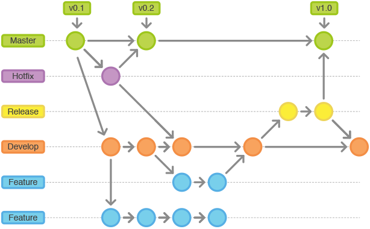

# Git 常用命令

## GIT 优势

- 由于是分布式，所有本地库包含了远程库的所有内容。
- 优秀的分支模型，打分支以及合并分支，方便。
- 快速，Git 由于代码都在本地，打分支和合并分支快速，使用个SVN的能深刻体会到这种优势。

## GIT 与 SVN 最主要的区别

- **SVN 是集中式版本控制系统**，版本库是集中放在中央服务器的，而干活的时候，用的都是自己的电脑，所以首先要从中央服务器哪里得到最新的版本，然后干活，干完后，需要把自己做完的活推送到中央服务器。集中式版本控制系统是必须联网才能工作，如果在局域网还可以，带宽够大，速度够快，如果在互联网下，如果网速慢的话，就纳闷了。
- **Git 是分布式版本控制系统**，那么它就没有中央服务器的，每个人的电脑就是一个完整的版本库，这样，工作的时候就不需要联网了，因为版本都是在自己的电脑上。既然每个人的电脑都有一个完整的版本库，那多个人如何协作呢？比如说自己在电脑上改了文件A，其他人也在电脑上改了文件A，这时，你们两之间只需把各自的修改推送给对方，就可以互相看到对方的修改了。

## GIT 下载

- 下载地址：https://git-scm.com/download/

## GIT 常用命令

### 生成密钥

```bash
ssh-keygen -t rsa -C '***@flc.io'

# 按3个回车。
# 最后得到了两个文件：id_rsa和id_rsa.pub（window和linux在当前用户目录/.ssh目录下）
# 其中id_rsa.pub即为公钥
```

### 设置 Git 的用户名和邮箱

```bash
git config --global user.name 'flc'
git config --global user.email '***@flc.io'
```

### 创建版本库

- 初始化一个版本仓库
    
    ```bash
    git init
    ```

- 克隆远程版本库（同时会自动初始化）
    
    ```bash
    # 如克隆thinkphp源码
    git clone https://github.com/top-think/thinkphp.git
    ```

- 添加远程版本库（需要先初始化）

    ```bash
    # 语法为 git remote add [shortname] [url]  
    git remote add origin https://github.com/top-think/thinkphp.git
    ```
### 提交 / 推送代码

```bash
# 查看文件状态
git status

# 添加当前修改的文件到暂存区  
git add .
git add [file_path]  # 指定文件

# 提交你的修改  
git commit –m "你的注释"

# 推送你的更新到远程服务器,语法为 git push [远程名] [本地分支]:[远程分支]  
git push origin master

# 查看提交的日志  
git log

# 修改最后一次提交注释的，利用–amend参数  
git commit --amend
```

### 分支管理

- 本地分支管理（查看、切换、创建和删除）

    ```bash
    git branch -r           # 查看远程分支
    git branch <new_branch> # 创建新的分支
    git branch -v           # 查看各个分支最后提交信息

    git checkout <branch>     # 切换到某个分支
    git checkout -b <new_branch> # 创建新的分支，并且切换过去
    git checkout -b <new_branch> <branch>  # 基于branch创建新的new_branch

    git branch -d <branch>  # 删除某个分支
    git branch -D <branch>  # 强制删除某个分支 (未被合并的分支被删除的时候需要强制)
    git push origin --delete <branch> # 删除远程分支
    ```

- 分支合并

    ```bash
    git merge <branch>               # 将branch分支合并到当前分支(Fast-Foward合并，不推荐)
    git merge <branch> --no-ff       # 不要Fast-Foward合并，这样可以生成merge提交（推荐）
    ```

- 远程分支管理

    ```bash
    git pull                         # 抓取远程仓库所有分支更新并合并到本地
    git pull --no-ff                 # 抓取远程仓库所有分支更新并合并到本地，不要快进合并
    git fetch origin                 # 抓取远程仓库更新
    git merge origin/master          # 将远程主分支合并到本地当前分支
    git checkout -b <local_branch> origin/<remote_branch>  # 基于远程分支创建本地分支

    git push                          # push所有分支
    git push origin <branch>          # 将本地主分支推到远程分支
    git push -u origin master         # 将本地主分支推到远程(如无远程主分支则创建，用于初始化远程仓库)
    git push origin <local_branch>    # 创建远程分支， origin是远程仓库名
    git push origin <local_branch>:<remote_branch>  # 创建远程分支
    git push origin :<remote_branch>  # 删除远程分支。先删除本地分支(git br -d <branch>)，然后再push删除远程分支
    git push origin --delete <branch> # 删除远程分支，功能同上
    ```

### 远程仓库管理

```bash
git remote -v                    # 查看远程服务器地址和仓库名称  
git remote show origin           # 查看远程服务器仓库状态  
git remote add origin git@ github:robbin/robbin_site.git         # 添加远程仓库地址  
git remote set-url origin git@ github.com:robbin/robbin_site.git # 设置远程仓库地址(用于修改远程仓库地址)  
git remote rm <repository>       # 删除远程仓库
```

### 更多教程

- http://justcoding.iteye.com/blog/1830388
- http://www.admin10000.com/document/5374.html

## 工作流介绍

### 流程图



### 参考

- http://www.cnblogs.com/cnblogsfans/p/5075073.html?utm_source=tuicool&utm_medium=referral
- 关键字：`git flow`

## 分支命名规则

- 主分支：`master`
- 开发分支：`develop`
- 功能分支：`feature/功能模块英文名`，如：`feature/user`
- 版本分支（预上线分支）：`release/功能模块英文名或版本号+年月日`，如：`release/user_20160101` 或 `release/v1.0.1_20160101`
- 修复分支：`hotfix/修复功能英文名或原版本号+年月日`，如：`hotfix/user_20160101` 或 `hotfix/v1.0.1_20160101`

## 版本号命名规则

> 如：`v1.1.1.1→vA.B.C.D`

**规则说明**

- `A`: 大版本更新，如大改版或者结构大调整。由项目经理决定此版本编号
- `B`: 功能模块，如用户中心，订单中心等大模块更新或调整。由开发主管决定此版本编号
- `C`: 功能迭代更新，由开发组长决定此版本编号
- `D`: hotfix 修复版本编号，由开发组长决定此版本编号；默认新迭代的版本，此版本编号默认为 `0`
- 每个独立的版本编号更新后，当前版本号后的版本编号重置为0，优先级：`A > B > C > D`