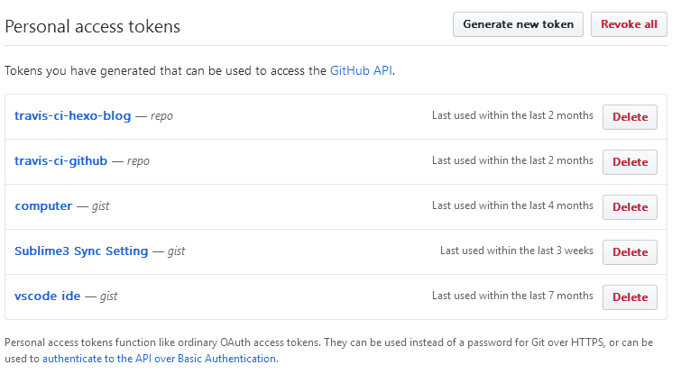

# Github + Travis + Mkdocs 搭建文档库

[TOC]

## 1. 概述

如何搭建一个免费的文档库站点？

### 1.1. 要求

- 了解 Python
- 有 Github 账号
- 熟悉 [Markdown](http://wow.kuapp.com/markdown/) 语法

### 1.2. 介绍

**Github：** 全球最大同性交友网站 :sweat_smile: :sweat_smile:

> GitHub is a development platform inspired by the way you work. From open source to business, you can host and review code, manage projects, and build software alongside 28 million developers.

**Travis：** 持续集成服务（Continuous Integration，简称 CI）

> **Test and Deploy with Confidence**  
> Easily sync your GitHub projects with Travis CI and you’ll be testing your code in minutes!

**Mkdocs：** 基于 Python 的开源文档库生成器

> MkDocs is a fast, simple and downright gorgeous static site generator that's geared towards building project documentation. Documentation source files are written in Markdown, and configured with a single YAML configuration file.

## 2. Mkdocs

### 2.1. 安装

```sh
pip install mkdocs
```

> 需安装Python，支持的版本：2.7,3.4,3.5,3.6,3.7

### 2.2. 创建文档库

```sh
mkdocs new my-docs # mkdocs new [项目目录]
```

### 2.3. 启用内置服务

```sh
# 启用服务，http://127.0.0.1:8000
mkdocs serve

# 指定IP 端口
mkdocs serve -a 0.0.0.0:8000 # mkdocs serve -a [ip:port]
```

> 支持编辑保存，自动编译

### 2.4. 编译构建站点

```sh
mkdocs build
```

### 2.5. Github Pages

自动编译发布至 Github `gh-pages` 分支

```sh
mkdocs gh-deploy
```

## Github

### 版本库

创建仓库，提交代码。

> 注意忽略 `site` 目录

### 申请 Token

- 访问地址：https://github.com/settings/tokens
- 点击右侧 `Generate new token` 按钮
- `Token description` 输入 Token 描述，随意
- 勾选权限 `Select scopes` 下的 `repo` 下所有
- 点击生成，将生成的 `token` 留好备用

**操作演示**



## Travis

### Travis 设置

- 进入集成服务列表： https://travis-ci.org/account/repositories

    > PS: 如项目不存在，点击左侧的 `Sync account` 按钮。

- 找到对应的仓库，点击右侧的开关，开启服务
- 点击右侧 `Settings` 进入设置界面
- 在 `Settings` 栏位下 `Environment Variables` 下新增环境变量名和对应值：
    
    |环境变量名|环境变量值|
    |----|----|
    |`GITHUB_TOKEN`|`980ff900b07d3efc78e1a6eaa1becb49ea5c9cab`|
    
    > 环境变量值为上步骤生成的 `Token`  
    > PS: 注意禁用右侧的`Display value in build log` 选项，避免敏感信息暴露在构建日志中

**相关操作如图**


### 配置 `.travis.yml`

仓库根目录创建文件 `.travis.yml`, 内容如下：

```yaml
language: python

python:
  - "3.6"

install:
  - pip install mkdocs
  - echo -e "machine github.com\n  login ${GITHUB_TOKEN}" > ~/.netrc

script:
  - mkdocs gh-deploy --force --clean

branches:
  only:
    - master
```

## 附录

- UPYUN

### 自定义域名

CNAME

## 结语

## 参考

- Mkdocs 官网：https://www.mkdocs.org/
