# 客户端配置说明(Windows\MAC OS)

## 一、下载客户端

- [AnyConnect—Windows 客户端](anyconnect-win-3.1.10010-pre-deploy-k9.msi)
- [AnyConnect—MAC 客户端](anyconnect-macos-4.8.00175-predeploy-k9.dmg)

## 二、安装使用

> Windows与IOS操作界面可能有所不同，操作流程相同

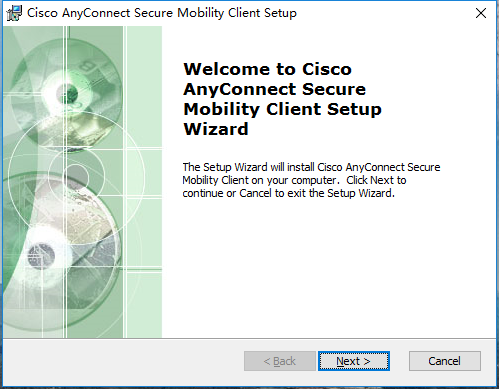

点击“Next”，选择接受

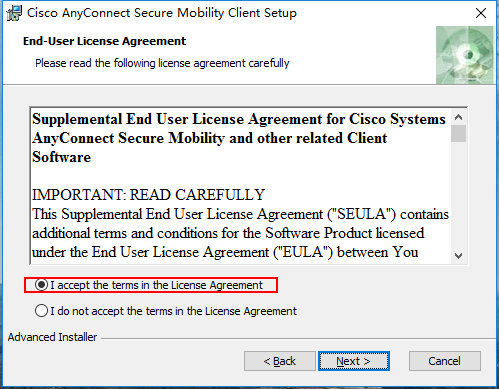

点击“ Install”

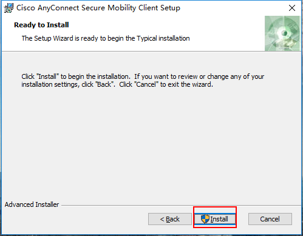

点击“Finish”完成安装

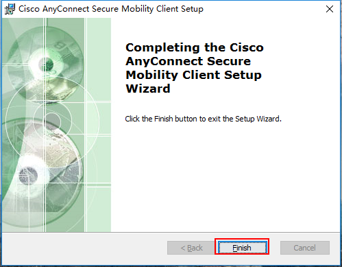

安装完成在电脑左下角开始菜单中找到AnyConnetc软件

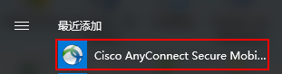

可以选择将其固定在标签页方便下次打开

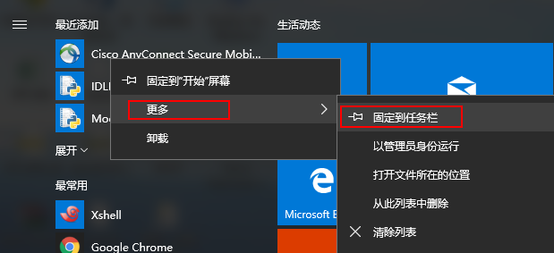

点击打开

第一次打开会弹出安全提示，点击“Change Setting...”

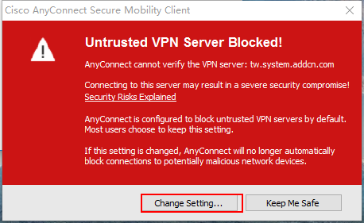

按照如图所示打钩，一定要去除红框内的选项

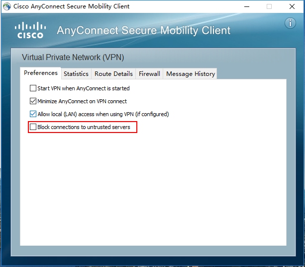

选择完成之后会提示安全选项，选择“Connect Anyway”

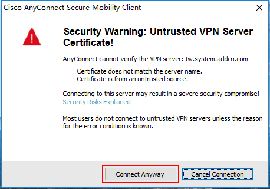

设置“服务器地址”

| 使用角色  | 线路说明 | 线路地址                           |
|-------|------|--------------------------------|
| 工程师   | 深圳线路 | sz\.system\.addcn\.com:10443   |
| 工程师   | 深圳联通 | szlt\.system\.addcn\.com:10443 |
| 工程师   | 台湾线路 | tw\.system\.addcn\.com:10443   |
| 营运与客服 | 深圳线路 | szct\.vpn\.addcn\.com:20443    |
| 营运与客服 | 台湾线路 | ct\.vpn\.addcn\.com:10443      |

点击‘Connect’

会提示安全验证，点击‘Connetc Anyway’

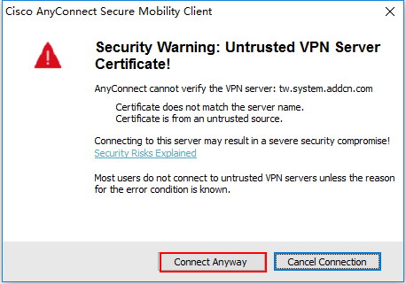

输入工号

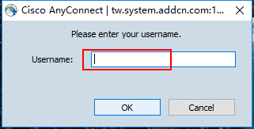

输入密码

- 工程职能：输入密码前缀+google身份验证器密码（不包括 + 加号）
- 营运与客服：OA 密码

> 密码前缀：2015

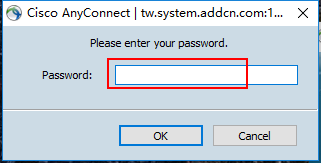

点击OK 连接

弹出如图所示框，表示已经连接

