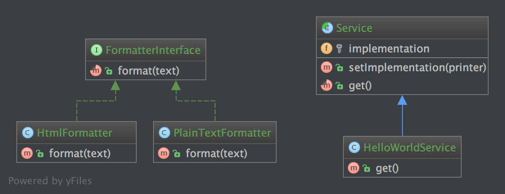

# 桥梁模式（Bridge）

## 1. 目的

将抽象与实现分离，这样两者可以独立地改变。

## 2. 例子

- [Symfony 学术桥梁](https://github.com/symfony/DoctrineBridge)

## 3. UML 图



## 4. 代码

你也可以在 [GitHub](https://github.com/domnikl/DesignPatternsPHP/tree/master/Structural/Bridge) 上查看代码

FormatterInterface.php

```php
<?php

namespace DesignPatterns\Structural\Bridge;

/**
* 创建格式化接口。
*/
interface FormatterInterface
{
    public function format(string $text);
}
```

PlainTextFormatter.php

```php
<?php

namespace DesignPatterns\Structural\Bridge;

/**
* 创建 PlainTextFormatter 文本格式类实现 FormatterInterface 接口。
*/
class PlainTextFormatter implements FormatterInterface
{

    /**
    * 返回字符串格式。
    */
    public function format(string $text)
    {
        return $text;
    }
}
```

HtmlFormatter.php

```php
<?php

namespace DesignPatterns\Structural\Bridge;

/**
* 创建 HtmlFormatter HTML 格式类实现 FormatterInterface 接口。
*/
class HtmlFormatter implements FormatterInterface
{

    /**
    * 返回 HTML 格式。
    */
    public function format(string $text)
    {
        return sprintf('<p>%s</p>', $text);
    }
}
```

Service.php

```php
<?php

namespace DesignPatterns\Structural\Bridge;

/**
* 创建抽象类 Service。
*/
abstract class Service
{
    /**
    * @var FormatterInterface
    * 定义实现属性。
    */
    protected $implementation;

    /**
    * @param FormatterInterface $printer
    * 传入 FormatterInterface 实现类对象。
    */
    public function __construct(FormatterInterface $printer)
    {
        $this->implementation = $printer;
    }

    /**
    * @param FormatterInterface $printer
    * 和构造方法的作用相同。
    */
    public function setImplementation(FormatterInterface $printer)
    {
        $this->implementation = $printer;
    }

    /**
    * 创建抽象方法 get() 。
    */
    abstract public function get();
}
```

HelloWorldService.php

```php
<?php

namespace DesignPatterns\Structural\Bridge;

/**
* 创建 Service 子类 HelloWorldService 。
*/
class HelloWorldService extends Service
{

    /**
    * 定义抽象方法 get() 。
    * 根据传入的格式类定义来格式化输出 'Hello World' 。
    */
    public function get()
    {
        return $this->implementation->format('Hello World');
    }
}
```

## 5. 测试

Tests/BridgeTest.php

```php
<?php

namespace DesignPatterns\Structural\Bridge\Tests;

use DesignPatterns\Structural\Bridge\HelloWorldService;
use DesignPatterns\Structural\Bridge\HtmlFormatter;
use DesignPatterns\Structural\Bridge\PlainTextFormatter;
use PHPUnit\Framework\TestCase;

/**
* 创建自动化测试单元 BridgeTest 。
*/
class BridgeTest extends TestCase
{

    /**
    * 使用 HelloWorldService 分别测试文本格式实现类和 HTML 格式实
    * 现类。
    */
    public function testCanPrintUsingThePlainTextPrinter()
    {
        $service = new HelloWorldService(new PlainTextFormatter());
        $this->assertEquals('Hello World', $service->get());

        // 现在更改实现方法为使用 HTML 格式器。
        $service->setImplementation(new HtmlFormatter());
        $this->assertEquals('<p>Hello World</p>', $service->get());
    }
}
```

----

原文：

- https://laravel-china.org/docs/php-design-patterns/2018/Bridge/1497