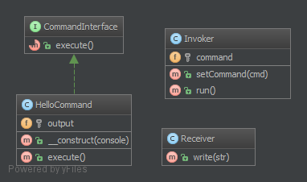

# 命令行模式（Command）

## 1. 目的

为了封装调用和解耦。

我们有一个调用程序和一个接收器。 这种模式使用「命令行」将方法调用委托给接收器并且呈现相同的「执行」方法。 因此，调用程序只知道调用「执行」去处理客户端的命令。接收器会从调用程序中分离出来。

这个模式的另一面是取消方法的 execute()，也就是 undo() 。命令行也可以通过最小量的复制粘贴和依赖组合（不是继承）被聚合，从而组合成更复杂的命令集。

## 2. 例子

- 文本编辑器：所有事件都是可以被解除、堆放，保存的命令。
- Symfony2：SF2 命令可以从 `CLI` 运行，它的建立只需考虑到命令行模式。
- 大型 `CLI` 工具使用子程序来分发不同的任务并将它们封装在「模型」中，每个模块都可以通过命令行模式实现（例如：`vagrant`）。

## 3. UML 图



## 4. 代码

你也可以在 [GitHub](https://github.com/domnikl/DesignPatternsPHP/tree/master/Behavioral/Command) 上查看源码

CommandInterface.php

```php
<?php

namespace DesignPatterns\Behavioral\Command;

interface CommandInterface
{
    /**
     * 这是在命令行模式中很重要的方法，
     * 这个接收者会被载入构造器
     */
    public function execute();
}
```

HelloCommand.php

```php
<?php

namespace DesignPatterns\Behavioral\Command;

/**
 * 这个具体命令，在接收器上调用 "print" ，
 *  但是外部调用者只知道，这个是否可以执行。
 */
class HelloCommand implements CommandInterface
{
    /**
     * @var Receiver
     */
    private $output;

    /**
     * 每个具体的命令都来自于不同的接收者。
     * 这个可以是一个或者多个接收者，但是参数里必须是可以被执行的命令。
     *
     * @param Receiver $console
     */
    public function __construct(Receiver $console)
    {
        $this->output = $console;
    }

    /**
     * 执行和输出 "Hello World".
     */
    public function execute()
    {
        // 有时候，这里没有接收者，并且这个命令执行所有工作。
        $this->output->write('Hello World');
    }
}
```

Receiver.php

```php
<?php

namespace DesignPatterns\Behavioral\Command;

/**
 * 接收方是特定的服务，有自己的 contract ，只能是具体的实例。
 */
class Receiver
{
    /**
     * @var bool
     */
    private $enableDate = false;

    /**
     * @var string[]
     */
    private $output = [];

    /**
     * @param string $str
     */
    public function write(string $str)
    {
        if ($this->enableDate) {
            $str .= ' ['.date('Y-m-d').']';
        }

        $this->output[] = $str;
    }

    public function getOutput(): string
    {
        return join("\n", $this->output);
    }

    /**
     * 可以显示消息的时间
     */
    public function enableDate()
    {
        $this->enableDate = true;
    }

    /**
     * 禁止显示消息的时间
     */
    public function disableDate()
    {
        $this->enableDate = false;
    }
}
```

Invoker.php

```php
<?php

namespace DesignPatterns\Behavioral\Command;

/**
 *调用者使用这种命令。
 * 比例 : 一个在 SF2 中的应用
 */
class Invoker
{
    /**
     * @var CommandInterface
     */
    private $command;

    /**
     * 在这种调用者中，我们发现，订阅命令也是这种方法
     * 还包括：堆栈、列表、集合等等
     *
     * @param CommandInterface $cmd
     */
    public function setCommand(CommandInterface $cmd)
    {
        $this->command = $cmd;
    }

    /**
     * 执行这个命令；
     * 调用者也是用这个命令。
     */
    public function run()
    {
        $this->command->execute();
    }
}
```

## 5. 测试

Tests/CommandTest.php

```php
<?php

namespace DesignPatterns\Behavioral\Command\Tests;

use DesignPatterns\Behavioral\Command\HelloCommand;
use DesignPatterns\Behavioral\Command\Invoker;
use DesignPatterns\Behavioral\Command\Receiver;
use PHPUnit\Framework\TestCase;

class CommandTest extends TestCase
{
    public function testInvocation()
    {
        $invoker = new Invoker();
        $receiver = new Receiver();

        $invoker->setCommand(new HelloCommand($receiver));
        $invoker->run();
        $this->assertEquals('Hello World', $receiver->getOutput());
    }
}
```

----

原文：

- https://laravel-china.org/docs/php-design-patterns/2018/Command/1508