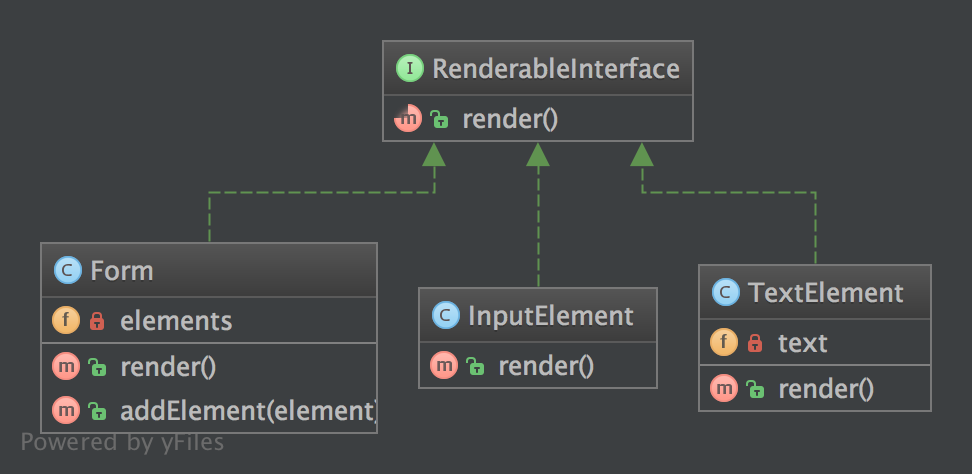

# 组合模式（Composite）

## 1. 目的

一组对象与该对象的单个实例的处理方式一致。

## 2. 示例

- 一个表单类实例在处理其表单所有元素的方法与处理该表单自身实例方法相同，在调用方法 `render()` 时，会随之遍历它的所有子元素并对他们调用 `render()` 方法
- `Zend_Config`: 一个配置选项树，每个选项自身就是一个 `Zend_Config` 对象

## 3. UML 图



## 4. 代码

相关代码参见 [GitHub](https://github.com/domnikl/DesignPatternsPHP/tree/master/Structural/Composite)

RenderableInterface.php

```php
<?php

namespace DesignPatterns\Structural\Composite;

interface RenderableInterface
{
    public function render(): string;
}
```

Form.php

```php
<?php

namespace DesignPatterns\Structural\Composite;

/**
 * 该组合内的节点必须派生于该组件契约。为了构建成一个组件树，
 * 此为强制性操作。
 */
class Form implements RenderableInterface
{
    /**
     * @var RenderableInterface[]
     */
    private $elements;

    /**
     * 遍历所有元素，并对他们调用 render() 方法，然后返回表单的完整
     * 的解析表达。
     *
     * 从外部上看，我们不会看到遍历过程，该表单的操作过程与单一对
     * 象实例一样
     *
     * @return string
     */
    public function render(): string
    {
        $formCode = '<form>';

        foreach ($this->elements as $element) {
            $formCode .= $element->render();
        }

        $formCode .= '</form>';

        return $formCode;
    }

    /**
     * @param RenderableInterface $element
     */
    public function addElement(RenderableInterface $element)
    {
        $this->elements[] = $element;
    }
}
```

InputElement.php

```php
<?php

namespace DesignPatterns\Structural\Composite;

class InputElement implements RenderableInterface
{
    public function render(): string
    {
        return '<input type="text" />';
    }
}
```

TextElement.php

```php
<?php

namespace DesignPatterns\Structural\Composite;

class TextElement implements RenderableInterface
{
    /**
     * @var string
     */
    private $text;

    public function __construct(string $text)
    {
        $this->text = $text;
    }

    public function render(): string
    {
        return $this->text;
    }
}
```

## 5. 测试

Tests/CompositeTest.php

```php
<?php

namespace DesignPatterns\Structural\Composite\Tests;

use DesignPatterns\Structural\Composite;
use PHPUnit\Framework\TestCase;

class CompositeTest extends TestCase
{
    public function testRender()
    {
        $form = new Composite\Form();
        $form->addElement(new Composite\TextElement('Email:'));
        $form->addElement(new Composite\InputElement());
        $embed = new Composite\Form();
        $embed->addElement(new Composite\TextElement('Password:'));
        $embed->addElement(new Composite\InputElement());
        $form->addElement($embed);

        // 此代码仅作示例。在实际场景中，现在的网页浏览器根本不支持
        // 多表单嵌套，牢记该点非常重要

        $this->assertEquals(
            '<form>Email:<input type="text" /><form>Password:<input type="text" /></form></form>',
            $form->render()
        );
    }
}
```

----

原文：

- https://laravel-china.org/docs/php-design-patterns/2018/Composite/1498