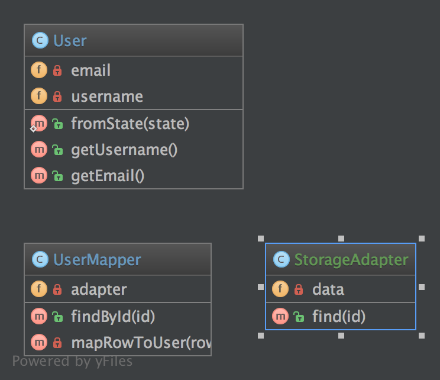

# 数据映射模式（Data Mapper）

## 1. 目标

数据映射器是一种数据访问层，它执行持久性数据存储（通常是关系数据库）和内存数据表示（域层）之间的数据双向传输。 该模式的目标是保持内存表示和持久数据存储相互独立，并保持数据映射器本身。 该层由一个或多个映射器（或数据访问对象）组成，执行数据传输。 映射器实现的范围有所不同。 通用映射器将处理许多不同的域实体类型，专用映射器将处理一个或几个。

这种模式的关键点在于，与活动记录模式不同，数据模型遵循单一责任原则。

## 2. 例子

- 数据库对象关系映射器（ `ORM` ）：`Doctrine2` 使用的 `DAO`，名字叫做 “ `EntityRepository` ”。

## 3. UML 图



## 4. 代码

你能在 [GitHub](https://github.com/domnikl/DesignPatternsPHP/tree/master/Structural/DataMapper) 上面找到这些代码

User.php

```php
<?php

namespace DesignPatterns\Structural\DataMapper;

class User
{
    /**
     * @var string
     */
    private $username;

    /**
     * @var string
     */
    private $email;

    public static function fromState(array $state): User
    {
        // 在你访问的时候验证状态

        return new self(
            $state['username'],
            $state['email']
        );
    }

    public function __construct(string $username, string $email)
    {
        // 先验证参数在设置他们

        $this->username = $username;
        $this->email = $email;
    }

    /**
     * @return string
     */
    public function getUsername()
    {
        return $this->username;
    }

    /**
     * @return string
     */
    public function getEmail()
    {
        return $this->email;
    }
}
```

UserMapper.php

```php
<?php

namespace DesignPatterns\Structural\DataMapper;

class UserMapper
{
    /**
     * @var StorageAdapter
     */
    private $adapter;

    /**
     * @param StorageAdapter $storage
     */
    public function __construct(StorageAdapter $storage)
    {
        $this->adapter = $storage;
    }

    /**
     * 根据 id 从存储器中找到用户，并返回一个用户对象
     * 在内存中，通常这种逻辑将使用 Repository 模式来实现
     * 然而，重要的部分是在下面的 mapRowToUser() 中，它将从中创建一个业务对象
     * 从存储中获取的数据
     *
     * @param int $id
     *
     * @return User
     */
    public function findById(int $id): User
    {
        $result = $this->adapter->find($id);

        if ($result === null) {
            throw new \InvalidArgumentException("User #$id not found");
        }

        return $this->mapRowToUser($result);
    }

    private function mapRowToUser(array $row): User
    {
        return User::fromState($row);
    }
}
```

StorageAdapter.php

```php
<?php

namespace DesignPatterns\Structural\DataMapper;

class StorageAdapter
{
    /**
     * @var array
     */
    private $data = [];

    public function __construct(array $data)
    {
        $this->data = $data;
    }

    /**
     * @param int $id
     *
     * @return array|null
     */
    public function find(int $id)
    {
        if (isset($this->data[$id])) {
            return $this->data[$id];
        }

        return null;
    }
}
```

## 5. 测试

Tests/DataMapperTest.php

```php
<?php

namespace DesignPatterns\Structural\DataMapper\Tests;

use DesignPatterns\Structural\DataMapper\StorageAdapter;
use DesignPatterns\Structural\DataMapper\User;
use DesignPatterns\Structural\DataMapper\UserMapper;
use PHPUnit\Framework\TestCase;

class DataMapperTest extends TestCase
{
    public function testCanMapUserFromStorage()
    {
        $storage = new StorageAdapter([1 => ['username' => 'domnikl', 'email' => 'liebler.dominik@gmail.com']]);
        $mapper = new UserMapper($storage);

        $user = $mapper->findById(1);

        $this->assertInstanceOf(User::class, $user);
    }

    /**
     * @expectedException \InvalidArgumentException
     */
    public function testWillNotMapInvalidData()
    {
        $storage = new StorageAdapter([]);
        $mapper = new UserMapper($storage);

        $mapper->findById(1);
    }
}
```

----

原文：

- https://laravel-china.org/docs/php-design-patterns/2018/DataMapper/1499