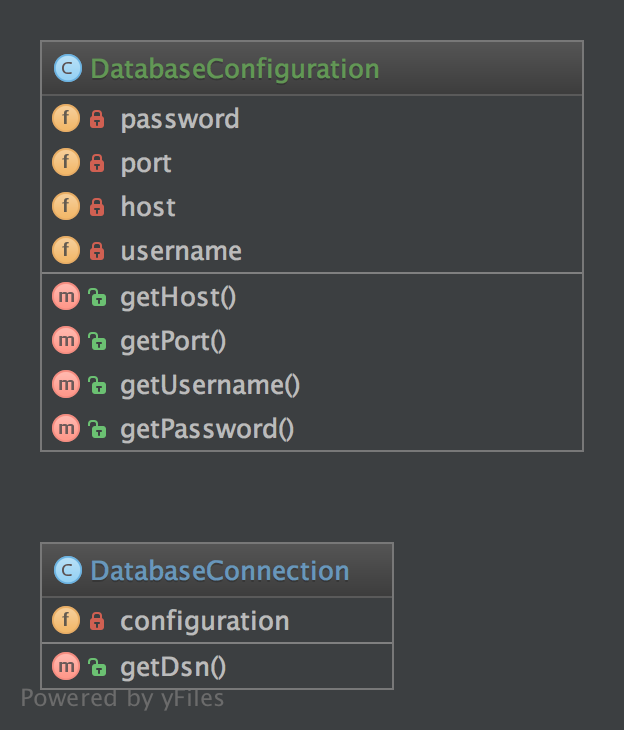

# 依赖注入模式（Dependency Injection）

## 1. 目的

用松散耦合的方式来更好的实现可测试、可维护和可扩展的代码。

## 2. 用法

DatabaseConfiguration 被注入 `DatabaseConnection` 并获取所需的 `$config` 。如果没有依赖注入模式， 配置将直接创建  `DatabaseConnection` 。这对测试和扩展来说很不好。

## 3. 例子

- Doctrine2 ORM 使用依赖注入。 例如，注入到 `Connection` 对象的配置。 对于测试而言， 可以轻松的创建可扩展的模拟数据并注入到 `Connection` 对象中。
- Symfony 和 Zend Framework 2 已经有了依赖注入的容器。他们通过配置的数组来创建对象，并在需要的地方注入 (在控制器中)。

## 4. UML 图



## 5. 代码

您可以在  [GitHub](https://github.com/domnikl/DesignPatternsPHP/tree/master/Structural/DependencyInjection) 查看这段代码

DatabaseConfiguration.php

```php
<?php

namespace DesignPatterns\Structural\DependencyInjection;

class DatabaseConfiguration
{
    /**
     * @var string
     */
    private $host;

    /**
     * @var int
     */
    private $port;

    /**
     * @var string
     */
    private $username;

    /**
     * @var string
     */
    private $password;

    public function __construct(string $host, int $port, string $username, string $password)
    {
        $this->host = $host;
        $this->port = $port;
        $this->username = $username;
        $this->password = $password;
    }

    public function getHost(): string
    {
        return $this->host;
    }

    public function getPort(): int
    {
        return $this->port;
    }

    public function getUsername(): string
    {
        return $this->username;
    }

    public function getPassword(): string
    {
        return $this->password;
    }
}
```

DatabaseConnection.php

```php
<?php

namespace DesignPatterns\Structural\DependencyInjection;

class DatabaseConnection
{
    /**
     * @var DatabaseConfiguration
     */
    private $configuration;

    /**
     * @param DatabaseConfiguration $config
     */
    public function __construct(DatabaseConfiguration $config)
    {
        $this->configuration = $config;
    }

    public function getDsn(): string
    {
        // 这仅仅是演示，而不是一个真正的  DSN
        // 注意，这里只使用了注入的配置。 所以，
        // 这里是关键的分离关注点。

        return sprintf(
            '%s:%s@%s:%d',
            $this->configuration->getUsername(),
            $this->configuration->getPassword(),
            $this->configuration->getHost(),
            $this->configuration->getPort()
        );
    }
}
```

## 6. 测试

Tests/DependencyInjectionTest.php

```php
<?php

namespace DesignPatterns\Structural\DependencyInjection\Tests;

use DesignPatterns\Structural\DependencyInjection\DatabaseConfiguration;
use DesignPatterns\Structural\DependencyInjection\DatabaseConnection;
use PHPUnit\Framework\TestCase;

class DependencyInjectionTest extends TestCase
{
    public function testDependencyInjection()
    {
        $config = new DatabaseConfiguration('localhost', 3306, 'domnikl', '1234');
        $connection = new DatabaseConnection($config);

        $this->assertEquals('domnikl:1234@localhost:3306', $connection->getDsn());
    }
}
```

----

原文：

- https://laravel-china.org/docs/php-design-patterns/2018/DependencyInjection/1501