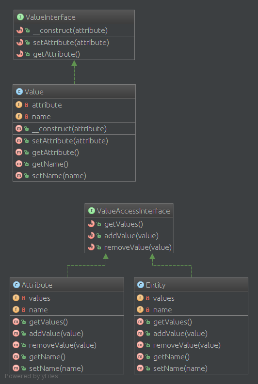

# 实体属性值模式（EAV 模式）

实体属性值（Entity--attribute--value EAV）模式，可以方便 PHP 实现 EAV 模型。

## 1. 目的

实体属性值模型（Entity-attribute-value EAV）是一种用数据模型描述实体的属性（属性，参数），可以用来形容他们潜在巨大，但实际上将适用于给定的实体的数量是相对较少。 在数学中，这种模式被称为一个稀疏矩阵 。 EAV也被称为对象的属性值的模式，垂直的数据库模型和开放式架构。

## 2. UML 图



## 4. 代码

你可以在 [GitHub](https://github.com/domnikl/DesignPatternsPHP/tree/master/More/EAV) 上找到这些代码

Entity.php

```php
<?php

namespace DesignPatterns\More\EAV;

class Entity
{
    /**
     * @var \SplObjectStorage
     */
    private $values;

    /**
     * @var string
     */
    private $name;

    /**
     * @param string $name
     * @param Value[] $values
     */
    public function __construct(string $name, $values)
    {
        $this->values = new \SplObjectStorage();
        $this->name = $name;

        foreach ($values as $value) {
            $this->values->attach($value);
        }
    }

    public function __toString(): string
    {
        $text = [$this->name];

        foreach ($this->values as $value) {
            $text[] = (string) $value;
        }

        return join(', ', $text);
    }
}
```

Attribute.php

```php
<?php

namespace DesignPatterns\More\EAV;

class Attribute
{
    /**
     * @var \SplObjectStorage
     */
    private $values;

    /**
     * @var string
     */
    private $name;

    public function __construct(string $name)
    {
        $this->values = new \SplObjectStorage();
        $this->name = $name;
    }

    public function addValue(Value $value)
    {
        $this->values->attach($value);
    }

    /**
     * @return \SplObjectStorage
     */
    public function getValues(): \SplObjectStorage
    {
        return $this->values;
    }

    public function __toString(): string
    {
        return $this->name;
    }
}
```

Value.php

```php
<?php

namespace DesignPatterns\More\EAV;

class Value
{
    /**
     * @var Attribute
     */
    private $attribute;

    /**
     * @var string
     */
    private $name;

    public function __construct(Attribute $attribute, string $name)
    {
        $this->name = $name;
        $this->attribute = $attribute;

        $attribute->addValue($this);
    }

    public function __toString(): string
    {
        return sprintf('%s: %s', $this->attribute, $this->name);
    }
}
```

## 4. 测试

Tests/EAVTest.php

```php
<?php

namespace DesignPatterns\More\EAV\Tests;

use DesignPatterns\More\EAV\Attribute;
use DesignPatterns\More\EAV\Entity;
use DesignPatterns\More\EAV\Value;
use PHPUnit\Framework\TestCase;

class EAVTest extends TestCase
{
    public function testCanAddAttributeToEntity()
    {
        $colorAttribute = new Attribute('color');
        $colorSilver = new Value($colorAttribute, 'silver');
        $colorBlack = new Value($colorAttribute, 'black');

        $memoryAttribute = new Attribute('memory');
        $memory8Gb = new Value($memoryAttribute, '8GB');

        $entity = new Entity('MacBook Pro', [$colorSilver, $colorBlack, $memory8Gb]);

        $this->assertEquals('MacBook Pro, color: silver, color: black, memory: 8GB', (string) $entity);
    }
}
```

----

原文：

- https://laravel-china.org/docs/php-design-patterns/2018/EAV/1523