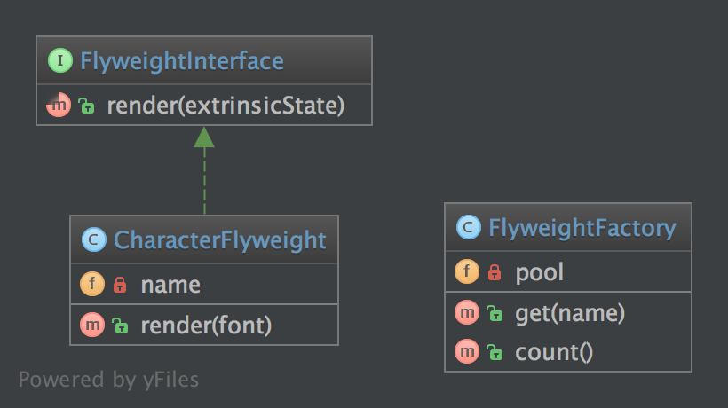

# 享元模式（Flyweight）

## 1. 目的

为了节约内存的使用，享元模式会尽量使类似的对象共享内存。在大量类似对象被使用的情况中这是十分必要的。常用做法是在外部数据结构中保存类似对象的状态，并在需要时将他们传递给享元对象。

## 2. UML 图



## 3. 代码

你也可以在 [GitHub](https://github.com/domnikl/DesignPatternsPHP/tree/master/Structural/Flyweight) 上查看此代码

FlyweightInterface.php

```php
<?php

namespace DesignPatterns\Structural\Flyweight;

/**
 * 创建享元接口 FlyweightInterface 。
 */
interface FlyweightInterface
{

   /**
    * 创建传递函数。
    * 返回字符串格式数据。
    */
    public function render(string $extrinsicState): string;
}
```

CharacterFlyweight.php

```php
<?php

namespace DesignPatterns\Structural\Flyweight;

/**
 * 假如可以的话，实现享元接口并增加内存存储内部状态。
 * 具体的享元实例被工厂类的方法共享。
 */
class CharacterFlyweight implements FlyweightInterface
{
    /**
     * 任何具体的享元对象存储的状态必须独立于其运行环境。
     * 享元对象呈现的特点，往往就是对应的编码的特点。
     *
     * @var string
     */
    private $name;

    /**
     * 输入一个字符串对象 $name。
     */
    public function __construct(string $name)
    {
        $this->name = $name;
    }

    /**
     * 实现 FlyweightInterface 中的传递方法 render() 。
     */
    public function render(string $font): string
    {
         // 享元对象需要客户端提供环境依赖信息来自我定制。
         // 外在状态经常包含享元对象呈现的特点，例如字符。

        return sprintf('Character %s with font %s', $this->name, $font);
    }
}
```

FlyweightFactory.php

```php
<?php

namespace DesignPatterns\Structural\Flyweight;

/**
 * 工厂类会管理分享享元类，客户端不应该直接将他们实例化。
 * 但可以让工厂类负责返回现有的对象或创建新的对象。
 */
class FlyweightFactory implements \Countable
{
    /**
     * @var CharacterFlyweight[]
     * 定义享元特征数组。
     * 用于存储不同的享元特征。
     */
    private $pool = [];

    /**
     * 输入字符串格式数据 $name。
     * 返回 CharacterFlyweight 对象。
     */
    public function get(string $name): CharacterFlyweight
    {
        if (!isset($this->pool[$name])) {
            $this->pool[$name] = new CharacterFlyweight($name);
        }

        return $this->pool[$name];
    }

    /**
     * 返回享元特征个数。
     */
    public function count(): int
    {
        return count($this->pool);
    }
}
```

## 4. 测试

Tests/FlyweightTest.php

```php
<?php

namespace DesignPatterns\Structural\Flyweight\Tests;

use DesignPatterns\Structural\Flyweight\FlyweightFactory;
use PHPUnit\Framework\TestCase;

/**
 * 创建自动化测试单元 FlyweightTest 。
 */
class FlyweightTest extends TestCase
{
    private $characters = ['a', 'b', 'c', 'd', 'e', 'f', 'g', 'h', 'i', 'j', 'k',
        'l', 'm', 'n', 'o', 'p', 'q', 'r', 's', 't', 'u', 'v', 'w', 'x', 'y', 'z'];
    private $fonts = ['Arial', 'Times New Roman', 'Verdana', 'Helvetica'];

    public function testFlyweight()
    {
        $factory = new FlyweightFactory();

        foreach ($this->characters as $char) {
            foreach ($this->fonts as $font) {
                $flyweight = $factory->get($char);
                $rendered = $flyweight->render($font);

                $this->assertEquals(sprintf('Character %s with font %s', $char, $font), $rendered);
            }
        }

        // 享元模式会保证实例被分享。
        // 相比拥有成百上千的私有对象，
        // 必须要有一个实例代表所有被重复使用来显示不同单词的字符。
        $this->assertCount(count($this->characters), $factory);
    }
}
```

----

原文：

- https://laravel-china.org/docs/php-design-patterns/2018/Flyweight/1504