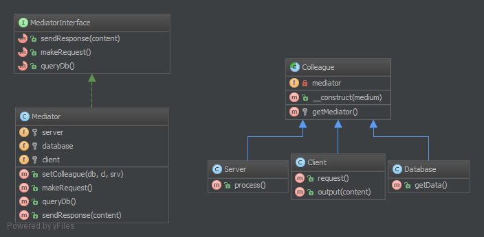

# 中介者模式（Mediator）

## 1. 目的

本模式提供了一种轻松的多组件之间弱耦合的协同方式。如果你有个“情报中心”，观察者模式也是个好选择，类似于控制器（并非 MVC 意义上的控制器）。

所有关联协同的组件（称作 `Colleague`）仅与 `MediatorInterface` 接口建立耦合，面向对象编程中这是好事，一个良友胜于有多个朋友。这是该模式的重要特性。

## 2. UML 图



## 3. 代码

代码查看 [GitHub](https://github.com/domnikl/DesignPatternsPHP/tree/master/Behavioral/Mediator)

MediatorInterface.php

```php
<?php

namespace DesignPatterns\Behavioral\Mediator;

/**
 * MediatorInterface 接口为 Mediator 类建立契约
 * 该接口虽非强制，但优于 Liskov 替换原则。
 */
interface MediatorInterface
{
    /**
     * 发出响应
     *
     * @param string $content
     */
    public function sendResponse($content);

    /**
     * 做出请求
     */
    public function makeRequest();

    /**
     * 查询数据库
     */
    public function queryDb();
}
```

Mediator.php

```php
<?php

namespace DesignPatterns\Behavioral\Mediator;

/**
 * Mediator 是用于访设计模式的中介者模式的实体
 *
 * 本示例中，我用中介者模式做了一个 “Hello World” 的响应
 */
class Mediator implements MediatorInterface
{
    /**
     * @var Subsystem\Server
     */
    private $server;

    /**
     * @var Subsystem\Database
     */
    private $database;

    /**
     * @var Subsystem\Client
     */
    private $client;

    /**
     * @param Subsystem\Database $database
     * @param Subsystem\Client $client
     * @param Subsystem\Server $server
     */
    public function __construct(Subsystem\Database $database, Subsystem\Client $client, Subsystem\Server $server)
    {
        $this->database = $database;
        $this->server = $server;
        $this->client = $client;

        $this->database->setMediator($this);
        $this->server->setMediator($this);
        $this->client->setMediator($this);
    }

    public function makeRequest()
    {
        $this->server->process();
    }

    public function queryDb(): string
    {
        return $this->database->getData();
    }

    /**
     * @param string $content
     */
    public function sendResponse($content)
    {
        $this->client->output($content);
    }
}
```

Colleague.php

```php
<?php

namespace DesignPatterns\Behavioral\Mediator;

/**
 * Colleague 是个抽象类，该类对象虽彼此协同却不知彼此，只知中介者 Mediator 类
 */
abstract class Colleague
{
    /**
     * 确保子类不变化。
     *
     * @var MediatorInterface
     */
    protected $mediator;

    /**
     * @param MediatorInterface $mediator
     */
    public function setMediator(MediatorInterface $mediator)
    {
        $this->mediator = $mediator;
    }
}
```

Subsystem/Client.php

```php
<?php

namespace DesignPatterns\Behavioral\Mediator\Subsystem;

use DesignPatterns\Behavioral\Mediator\Colleague;

/**
 * Client 类是一个发出请求并获得响应的客户端。
 */
class Client extends Colleague
{
    public function request()
    {
        $this->mediator->makeRequest();
    }

    public function output(string $content)
    {
        echo $content;
    }
}
```

Subsystem/Database.php

```php
<?php

namespace DesignPatterns\Behavioral\Mediator\Subsystem;

use DesignPatterns\Behavioral\Mediator\Colleague;

class Database extends Colleague
{
    public function getData(): string
    {
        return 'World';
    }
}
```

Subsystem/Server.php

```php
<?php

namespace DesignPatterns\Behavioral\Mediator\Subsystem;

use DesignPatterns\Behavioral\Mediator\Colleague;

class Server extends Colleague
{
    public function process()
    {
        $data = $this->mediator->queryDb();
        $this->mediator->sendResponse(sprintf("Hello %s", $data));
    }
}
```

## 4. 测试

Tests/MediatorTest.php

```php
<?php

namespace DesignPatterns\Tests\Mediator\Tests;

use DesignPatterns\Behavioral\Mediator\Mediator;
use DesignPatterns\Behavioral\Mediator\Subsystem\Client;
use DesignPatterns\Behavioral\Mediator\Subsystem\Database;
use DesignPatterns\Behavioral\Mediator\Subsystem\Server;
use PHPUnit\Framework\TestCase;

class MediatorTest extends TestCase
{
    public function testOutputHelloWorld()
    {
        $client = new Client();
        new Mediator(new Database(), $client, new Server());

        $this->expectOutputString('Hello World');
        $client->request();
    }
}
```

----

原文：

- https://laravel-china.org/docs/php-design-patterns/2018/Mediator/1510