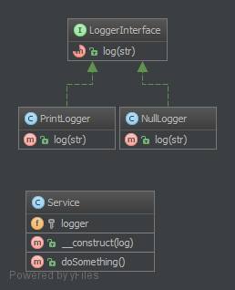

# 空对象模式（Null Object）

## 1. 目的

空对象模式不属于 `GoF` 设计模式，但是它作为一种经常出现的套路足以被视为设计模式了。它具有如下优点：

- 客户端代码简单
- 可以减少报空指针异常的几率
- 测试用例不需要考虑太多条件

返回一个对象或 null 应该用返回对象或者 `NullObject` 代替。`NullObject` 简化了死板的代码，消除了客户端代码中的条件检查，例如 `if (!is_null($obj)) { $obj->callSomething(); }` 只需 `$obj->callSomething();` 就行。

## 2. 例子

- Symfony2: 空日志
- Symfony2: `Symfony/Console` 空输出
- 责任链模式中的空处理器
- 命令行模式中的空命令

## 3. UML 类图



## 4. 代码

你也可以在 [GitHub](https://github.com/domnikl/DesignPatternsPHP/tree/master/Behavioral/NullObject) 上查看此代码

Service.php

```php
<?php

namespace DesignPatterns\Behavioral\NullObject;

/**
 * 创建服务类 Service 。
 */
class Service
{
    /**
     * @var LoggerInterface
     * 定义日记类对象。
     */
    private $logger;

    /**
     * @param LoggerInterface $logger
     * 传入日记类对象参数。
     */
    public function __construct(LoggerInterface $logger)
    {
        $this->logger = $logger;
    }

    /**
     * 做些什么。。。
     * 在日记中返回了 '我们在 Service: doSomething 里' 。
     */
    public function doSomething()
    {
        // 提示：这里你只是使用它，而不需要通过如：is_null() 检查 $logger 是否已经设置。
        $this->logger->log('We are in '.__METHOD__);
    }
}
```

LoggerInterface.php

```php
<?php

namespace DesignPatterns\Behavioral\NullObject;

/**
 * 重要特征：空日记必须像其他日记意向从这个接口继承。
 */
interface LoggerInterface
{
    public function log(string $str);
}
```

PrintLogger.php

```php
<?php

namespace DesignPatterns\Behavioral\NullObject;

/**
 * 创建一个日记打印类实现日记接口。
 */
class PrintLogger implements LoggerInterface
{
    public function log(string $str)
    {
        echo $str;
    }
}
```

NullLogger.php

```php
<?php

namespace DesignPatterns\Behavioral\NullObject;

/**
 * 创建一个空日记类实现日记接口。
 */
class NullLogger implements LoggerInterface
{
    public function log(string $str)
    {
        // 什么也不用做
    }
}
```

## 5. 测试

Tests/LoggerTest.php

```php
<?php

namespace DesignPatterns\Behavioral\NullObject\Tests;

use DesignPatterns\Behavioral\NullObject\NullLogger;
use DesignPatterns\Behavioral\NullObject\PrintLogger;
use DesignPatterns\Behavioral\NullObject\Service;
use PHPUnit\Framework\TestCase;

/**
 * 创建测试单元 LoggerTest 。
 */
class LoggerTest extends TestCase
{
    /**
     * 测试 NullLogger 对象，联系上文可以知道什么也没做。
     */
    public function testNullObject()
    {
        $service = new Service(new NullLogger());
        $this->expectOutputString('');
        $service->doSomething();
    }

    /**
     * 测试 PrintLogger 对象，联系上文可以知道在日记中写入了 DesignPatterns\Behavioral\NullObject\Service::doSomething 。
     */
    public function testStandardLogger()
    {
        $service = new Service(new PrintLogger());
        $this->expectOutputString('We are in DesignPatterns\Behavioral\NullObject\Service::doSomething');
        $service->doSomething();
    }
}
```

----

原文：

- https://laravel-china.org/docs/php-design-patterns/2018/NullObject/1512