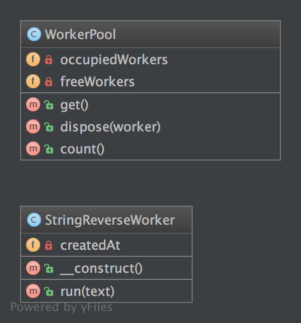

# 对象池模式（Pool）

## 1. 目的

**对象池模式**是一种提前准备了一组已经初始化了的对象『池』而不是按需创建或者销毁的创建型设计模式。对象池的客户端会向对象池中请求一个对象，然后使用这个返回的对象执行相关操作。当客户端使用完毕，它将把这个特定类型的工厂对象返回给对象池，而不是销毁掉这个对象。

在初始化实例成本高，实例化率高，可用实例不足的情况下，对象池可以极大地提升性能。在创建对象（尤其是通过网络）时间花销不确定的情况下，通过对象池在可期时间内就可以获得所需的对象。

无论如何，对象池模式在需要耗时创建对象方面，例如创建数据库连接，套接字连接，线程和大型图形对象（比方字体或位图等），使用起来都是大有裨益的。在某些情况下，简单的对象池（无外部资源，只占内存）可能效率不高，甚至会有损性能。

## 2. UML 类图



## 3. 代码

你可以在 [GitHub](https://github.com/domnikl/DesignPatternsPHP/tree/master/Creational/Pool) 上找到这些例子

WorkerPool.php

```php
<?php

namespace DesignPatterns\Creational\Pool;

class WorkerPool implements \Countable
{
    /**
    * @var StringReverseWorker[]
    */
    private $occupiedWorkers = [];

    /**
    * @var StringReverseWorker[]
    */
    private $freeWorkers = [];

    public function get(): StringReverseWorker
    {
        if (count($this->freeWorkers) == 0) {
            $worker = new StringReverseWorker();
        } else {
            $worker = array_pop($this->freeWorkers);
        }

        $this->occupiedWorkers[spl_object_hash($worker)] = $worker;

        return $worker;
    }

    public function dispose(StringReverseWorker $worker)
    {
        $key = spl_object_hash($worker);

        if (isset($this->occupiedWorkers[$key])) {
            unset($this->occupiedWorkers[$key]);
            $this->freeWorkers[$key] = $worker;
        }
    }

    public function count(): int
    {
        return count($this->occupiedWorkers) + count($this->freeWorkers);
    }
}
```

StringReverseWorker.php

```php
<?php

namespace DesignPatterns\Creational\Pool;

class StringReverseWorker
{
    /**
    * @var \DateTime
    */
    private $createdAt;

    public function __construct()
    {
        $this->createdAt = new \DateTime();
    }

    public function run(string $text)
    {
        return strrev($text);
    }
}
```

## 4. 测试

Tests/PoolTest.php

```php
<?php

namespace DesignPatterns\Creational\Pool\Tests;

use DesignPatterns\Creational\Pool\WorkerPool;
use PHPUnit\Framework\TestCase;

class PoolTest extends TestCase
{
    public function testCanGetNewInstancesWithGet()
    {
        $pool = new WorkerPool();
        $worker1 = $pool->get();
        $worker2 = $pool->get();

        $this->assertCount(2, $pool);
        $this->assertNotSame($worker1, $worker2);
    }

    public function testCanGetSameInstanceTwiceWhenDisposingItFirst()
    {
        $pool = new WorkerPool();
        $worker1 = $pool->get();
        $pool->dispose($worker1);
        $worker2 = $pool->get();

        $this->assertCount(1, $pool);
        $this->assertSame($worker1, $worker2);
    }
}
```

----

原文：

- https://laravel-china.org/docs/php-design-patterns/2018/Pool/1491