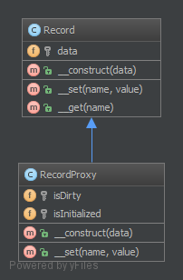

# 代理模式（Proxy）

## 1. 目的

链接任何具有高价值或无法复制的代码。

## 2. 举例

- Doctrine2 使用代理来实现框架的“魔术”（例如：延迟加载），而用户仍然使用他们自己的实体类且不会使用到代理。

## 3. UML 图



## 4. 代码

源代码在这里： [GitHub](https://github.com/domnikl/DesignPatternsPHP/tree/master/Structural/Proxy)

Record.php

```php
<?php

namespace DesignPatterns\Structural\Proxy;

/**
 * @property 用户名
 */
class Record
{
    /**
     * @var string[]
     */
    private $data;

    /**
     * @param string[] $data
     */
    public function __construct(array $data = [])
    {
        $this->data = $data;
    }

    /**
     * @param string $name
     * @param string  $value
     */
    public function __set(string $name, string $value)
    {
        $this->data[$name] = $value;
    }

    public function __get(string $name): string
    {
        if (!isset($this->data[$name])) {
            throw new \OutOfRangeException('Invalid name given');
        }

        return $this->data[$name];
    }
}
```

RecordProxy.php

```php
<?php

namespace DesignPatterns\Structural\Proxy;

class RecordProxy extends Record
{
    /**
     * @var bool
     */
    private $isDirty = false;

    /**
     * @var bool
     */
    private $isInitialized = false;

    /**
     * @param array $data
     */
    public function __construct(array $data)
    {
        parent::__construct($data);
        // 当记录有数据的时候，将 initialized 标记为 true ，
        // 因为记录将保存我们的业务逻辑，我们不希望在 Record 类里面实现这个行为
        // 而是在继承了 Record 的代理类中去实现。
        if (count($data) > 0) {
            $this->isInitialized = true;
            $this->isDirty = true;
        }
    }

    /**
     * @param string $name
     * @param string  $value
     */
    public function __set(string $name, string $value)
    {
        $this->isDirty = true;

        parent::__set($name, $value);
    }

    public function isDirty(): bool
    {
        return $this->isDirty;
    }
}
```

----

原文：

- https://laravel-china.org/docs/php-design-patterns/2018/Proxy/1505