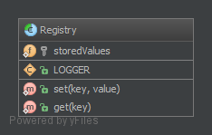

# 注册模式（Registry）

## 1. 目的

目的是能够存储在应用程序中经常使用的对象实例，通常会使用只有静态方法的抽象类来实现（或使用单例模式）。需要注意的是这里可能会引入全局的状态，我们需要使用依赖注入来避免它。

## 2. 例子

- Zend 框架：`Zend_Registry` 实现了整个应用程序的 `logger` 对象和前端控制器等
- Yii 框架：`CWebApplication` 具有全部应用程序组件，例如 `CWebUser`，`CUrlManager` 等。

## 3. UML 图



## 4. 代码

你也可以在 [GitHub](https://github.com/domnikl/DesignPatternsPHP/tree/master/Structural/Registry) 上找到此代码

Registry.php

```php
<?php

namespace DesignPatterns\Structural\Registry;

/**
 * 创建注册表抽象类。
 */
abstract class Registry
{
    const LOGGER = 'logger';

    /**
     * 这里将在你的应用中引入全局状态，但是不可以被模拟测试。
     * 因此被视作一种反抗模式！使用依赖注入进行替换！
     *
     * @var array
     * 定义存储值数组。
     */
    private static $storedValues = [];

    /**
     * @var array
     * 定义合法键名数组。
     * 可在此定义用户名唯一性。
     */
    private static $allowedKeys = [
        self::LOGGER,
    ];

    /**
     * @param string $key
     * @param mixed  $value
     *
     * @return void
     * 设置键值，并保存进 $storedValues 。
     * 可视作设置密码。
     */
    public static function set(string $key, $value)
    {
        if (!in_array($key, self::$allowedKeys)) {
            throw new \InvalidArgumentException('Invalid key given');
        }

        self::$storedValues[$key] = $value;
    }

    /**
     * @param string $key
     * 
     * @return mixed
     * 定义获取方法，获取已存储的对应键的值
     * 可视作验证用户环节，检查用户名是否存在，返回密码，后续验证密码正确性。
     */
    public static function get(string $key)
    {
        if (!in_array($key, self::$allowedKeys) || !isset(self::$storedValues[$key])) {
            throw new \InvalidArgumentException('Invalid key given');
        }

        return self::$storedValues[$key];
    }
}
```

## 5. 测试

Tests/RegistryTest.php

```php
<?php

namespace DesignPatterns\Structural\Registry\Tests;

use DesignPatterns\Structural\Registry\Registry;
use stdClass;
use PHPUnit\Framework\TestCase;

/**
* 创建自动化测试单元。
*/
class RegistryTest extends TestCase
{
    public function testSetAndGetLogger()
    {
        $key = Registry::LOGGER;
        $logger = new stdClass();

        Registry::set($key, $logger);
        $storedLogger = Registry::get($key);

        $this->assertSame($logger, $storedLogger);
        $this->assertInstanceOf(stdClass::class, $storedLogger);
    }

    /**
     * @expectedException \InvalidArgumentException
     */
    public function testThrowsExceptionWhenTryingToSetInvalidKey()
    {
        Registry::set('foobar', new stdClass());
    }

    /**
     * 注 @在此运行隔离进程：没有它的话，前一个测试单元可能已经设置它，
     * 并且测试将不能运行，这就是为什么你应该实现依赖注入，
     * 因为注入类会很容易被测试单元替代。
     *
     * @runInSeparateProcess
     * @expectedException \InvalidArgumentException
     */
    public function testThrowsExceptionWhenTryingToGetNotSetKey()
    {
        Registry::get(Registry::LOGGER);
    }
}
```

----

原文：

- https://laravel-china.org/docs/php-design-patterns/2018/Registry/1506