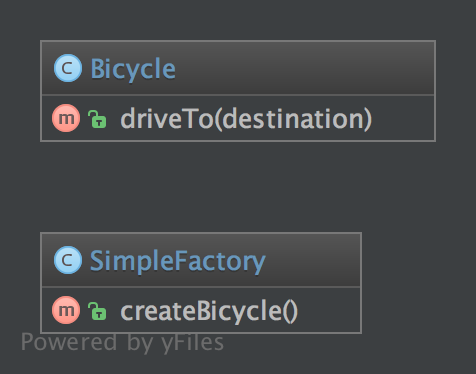

# 简单工厂模式（Simple Factory）

## 1. 目的

简单工厂模式是一个精简版的工厂模式。

它与静态工厂模式最大的区别是它不是『静态』的。因为非静态，所以你可以拥有多个不同参数的工厂，你可以为其创建子类。甚至可以模拟（Mock）他，这对编写可测试的代码来讲至关重要。 这也是它比静态工厂模式受欢迎的原因！

## 2. UML 图



## 3. 代码

你可以在 [GitHub](https://github.com/domnikl/DesignPatternsPHP/tree/master/Creational/SimpleFactory) 查看这段代码。

SimpleFactory.php

```php
<?php

namespace DesignPatterns\Creational\SimpleFactory;

class SimpleFactory
{
    public function createBicycle(): Bicycle
    {
        return new Bicycle();
    }
}
```

Bicycle.php

```php
<?php

namespace DesignPatterns\Creational\SimpleFactory;

class Bicycle
{
    public function driveTo(string $destination)
    {
    }
}
```

## 4. 用法

```php
<?php
$factory = new SimpleFactory();
$bicycle = $factory->createBicycle();
$bicycle->driveTo('Paris');
```

## 5. 测试

Tests/SimpleFactoryTest.php

```php
<?php

namespace DesignPatterns\Creational\SimpleFactory\Tests;

use DesignPatterns\Creational\SimpleFactory\Bicycle;
use DesignPatterns\Creational\SimpleFactory\SimpleFactory;
use PHPUnit\Framework\TestCase;

class SimpleFactoryTest extends TestCase
{
    public function testCanCreateBicycle()
    {
        $bicycle = (new SimpleFactory())->createBicycle();
        $this->assertInstanceOf(Bicycle::class, $bicycle);
    }
}
```

----

原文：

- https://laravel-china.org/docs/php-design-patterns/2018/SimpleFactory/1493