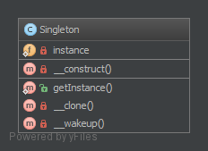

# 单例模式（Singleton）

**单例模式被公认为是 [反面模式](https://laravel-china.org/docs/php-design-patterns/2018/anti-pattern)，为了获得更好的可测试性和可维护性，请使用『[依赖注入模式](https://laravel-china.org/docs/php-design-patterns/2018/DependencyInjection)』。**

## 1. 目的

在应用程序调用的时候，只能获得一个对象实例。

## 2. 例子

- 数据库连接
- 日志 (多种不同用途的日志也可能会成为多例模式)
- 在应用中锁定文件 (系统中只存在一个 ...)

## 3. UML 类图



## 4. 代码部分

你也可以在 [GitHub](https://github.com/domnikl/DesignPatternsPHP/tree/master/Creational/Singleton) 中查看

Singleton.php

```php
<?php

namespace DesignPatterns\Creational\Singleton;

final class Singleton
{
    /**
    * @var Singleton
    */
    private static $instance;

    /**
    * 通过懒加载获得实例（在第一次使用的时候创建）
    */
    public static function getInstance(): Singleton
    {
        if (null === static::$instance) {
            static::$instance = new static();
        }

        return static::$instance;
    }

    /**
    * 不允许从外部调用以防止创建多个实例
    * 要使用单例，必须通过 Singleton::getInstance() 方法获取实例
    */
    private function __construct()
    {
    }

    /**
    * 防止实例被克隆（这会创建实例的副本）
    */
    private function __clone()
    {
    }

    /**
    * 防止反序列化（这将创建它的副本）
    */
    private function __wakeup()
    {
    }
}
```

## 5. 测试

Tests/SingletonTest.php

```php
<?php

namespace DesignPatterns\Creational\Singleton\Tests;

use DesignPatterns\Creational\Singleton\Singleton;
use PHPUnit\Framework\TestCase;

class SingletonTest extends TestCase
{
    public function testUniqueness()
    {
        $firstCall = Singleton::getInstance();
        $secondCall = Singleton::getInstance();

        $this->assertInstanceOf(Singleton::class, $firstCall);
        $this->assertSame($firstCall, $secondCall);
    }
}
```

----

原文：

- https://laravel-china.org/docs/php-design-patterns/2018/Singleton/1494