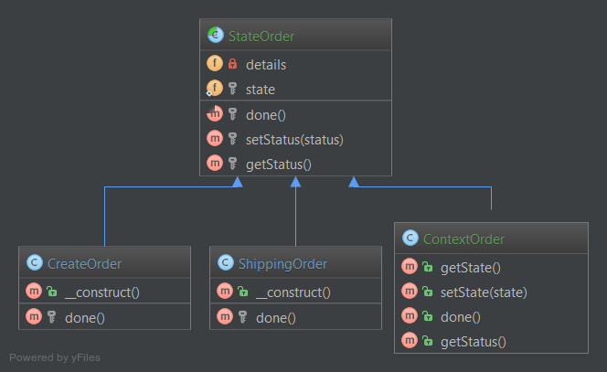

# 状态模式（State）

## 1. 目的

状态模式可以基于一个对象的同种事务而封装出不同的行为。它提供一种简洁的方式使得对象在运行时可以改变自身行为，而不必借助单一庞大的条件判断语句。

## 2. UML 图



## 3. 代码

你可以在 [GitHub](https://github.com/domnikl/DesignPatternsPHP/tree/master/Behavioral/State) 上找到这些代码

ContextOrder.php

```php
<?php

namespace DesignPatterns\Behavioral\State;

class ContextOrder extends StateOrder
{
    public function getState():StateOrder
    {
        return static::$state;
    }

    public function setState(StateOrder $state)
    {
        static::$state = $state;
    }

    public function done()
    {
        static::$state->done();
    }

    public function getStatus(): string
    {
        return static::$state->getStatus();
    }
}
```

StateOrder.php

```php
<?php

namespace DesignPatterns\Behavioral\State;

abstract class StateOrder
{
    /**
     * @var array
     */
    private $details;

    /**
     * @var StateOrder $state
     */
    protected static $state;

    /**
     * @return mixed
     */
    abstract protected function done();

    protected function setStatus(string $status)
    {
        $this->details['status'] = $status;
        $this->details['updatedTime'] = time();
    }

    protected function getStatus(): string
    {
        return $this->details['status'];
    }
}
```

ShippingOrder.php

```php
<?php

namespace DesignPatterns\Behavioral\State;

class ShippingOrder extends StateOrder
{
    public function __construct()
    {
        $this->setStatus('shipping');
    }

    protected function done()
    {
        $this->setStatus('completed');
    }
}
```

CreateOrder.php

```php
<?php

namespace DesignPatterns\Behavioral\State;

class CreateOrder extends StateOrder
{
    public function __construct()
    {
        $this->setStatus('created');
    }

    protected function done()
    {
        static::$state = new ShippingOrder();
    }
}
```

## 4. 测试

Tests/StateTest.php

```php
<?php

namespace DesignPatterns\Behavioral\State\Tests;

use DesignPatterns\Behavioral\State\ContextOrder;
use DesignPatterns\Behavioral\State\CreateOrder;
use PHPUnit\Framework\TestCase;

class StateTest extends TestCase
{
    public function testCanShipCreatedOrder()
    {
        $order = new CreateOrder();
        $contextOrder = new ContextOrder();
        $contextOrder->setState($order);
        $contextOrder->done();

        $this->assertEquals('shipping', $contextOrder->getStatus());
    }

    public function testCanCompleteShippedOrder()
    {
        $order = new CreateOrder();
        $contextOrder = new ContextOrder();
        $contextOrder->setState($order);
        $contextOrder->done();
        $contextOrder->done();

        $this->assertEquals('completed', $contextOrder->getStatus());
    }
}
```

----

原文：

- https://laravel-china.org/docs/php-design-patterns/2018/State/1515