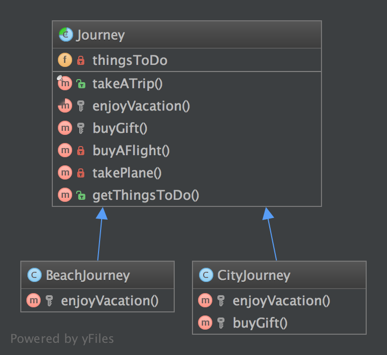

# 模板方法模式（Template Method）

## 1. 目的

模板方法模式是一种行为型的设计模式。

可能你已经见过这种模式很多次了。它是一种让抽象模板的子类「完成」一系列算法的行为策略。

众所周知的「好莱坞原则」：「不要打电话给我们，我们会打电话给你」。这个类不是由子类调用的，而是以相反的方式。怎么做？当然很抽象啦！

换而言之，它是一种非常适合框架库的算法骨架。用户只需要实现子类的一种方法，其父类便可去搞定这项工作了。

这是一种分离具体类的简单办法，且可以减少复制粘贴，这也是它常见的原因。

## 2. UML 图



## 3. 代码

你可以在 [GitHub](https://github.com/domnikl/DesignPatternsPHP/tree/master/Behavioral/TemplateMethod) 上找到这些代码

Journey.php

```php
<?php

namespace DesignPatterns\Behavioral\TemplateMethod;

abstract class Journey
{
    /**
     * @var string[]
     */
    private $thingsToDo = [];

    /**
     * 这是当前类及其子类提供的公共服务
     * 注意，它「冻结」了全局的算法行为
     * 如果你想重写这个契约，只需要实现一个包含 takeATrip() 方法的接口
     */
    final public function takeATrip()
    {
        $this->thingsToDo[] = $this->buyAFlight();
        $this->thingsToDo[] = $this->takePlane();
        $this->thingsToDo[] = $this->enjoyVacation();
        $buyGift = $this->buyGift();

        if ($buyGift !== null) {
            $this->thingsToDo[] = $buyGift;
        }

        $this->thingsToDo[] = $this->takePlane();
    }

    /**
     * 这个方法必须要实现，它是这个模式的关键点
     */
    abstract protected function enjoyVacation(): string;

    /**
     * 这个方法是可选的，也可能作为算法的一部分
     * 如果需要的话你可以重写它
     *
     * @return null|string
     */
    protected function buyGift()
    {
        return null;
    }

    private function buyAFlight(): string
    {
        return 'Buy a flight ticket';
    }

    private function takePlane(): string
    {
        return 'Taking the plane';
    }

    /**
     * @return string[]
     */
    public function getThingsToDo(): array
    {
        return $this->thingsToDo;
    }
}
```

BeachJourney.php

```php
<?php

namespace DesignPatterns\Behavioral\TemplateMethod;

class BeachJourney extends Journey
{
    protected function enjoyVacation(): string
    {
        return "Swimming and sun-bathing";
    }
}
```

CityJourney.php

```php
<?php

namespace DesignPatterns\Behavioral\TemplateMethod;

class CityJourney extends Journey
{
    protected function enjoyVacation(): string
    {
        return "Eat, drink, take photos and sleep";
    }

    protected function buyGift(): string
    {
        return "Buy a gift";
    }
}
```

## 4. 测试

Tests/JourneyTest.php

```php
<?php

namespace DesignPatterns\Behavioral\TemplateMethod\Tests;

use DesignPatterns\Behavioral\TemplateMethod;
use PHPUnit\Framework\TestCase;

class JourneyTest extends TestCase
{
    public function testCanGetOnVacationOnTheBeach()
    {
        $beachJourney = new TemplateMethod\BeachJourney();
        $beachJourney->takeATrip();

        $this->assertEquals(
            ['Buy a flight ticket', 'Taking the plane', 'Swimming and sun-bathing', 'Taking the plane'],
            $beachJourney->getThingsToDo()
        );
    }

    public function testCanGetOnAJourneyToACity()
    {
        $beachJourney = new TemplateMethod\CityJourney();
        $beachJourney->takeATrip();

        $this->assertEquals(
            [
                'Buy a flight ticket',
                'Taking the plane',
                'Eat, drink, take photos and sleep',
                'Buy a gift',
                'Taking the plane'
            ],
            $beachJourney->getThingsToDo()
        );
    }
}
```

----

原文：

- https://laravel-china.org/docs/php-design-patterns/2018/TemplateMethod/1517